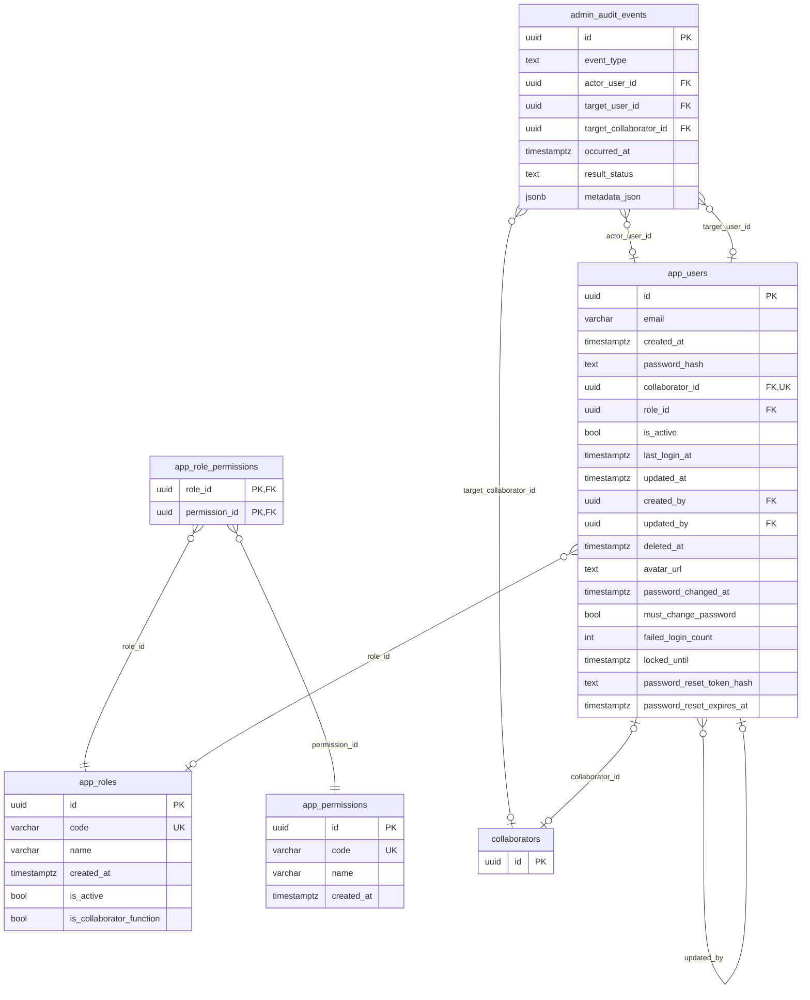
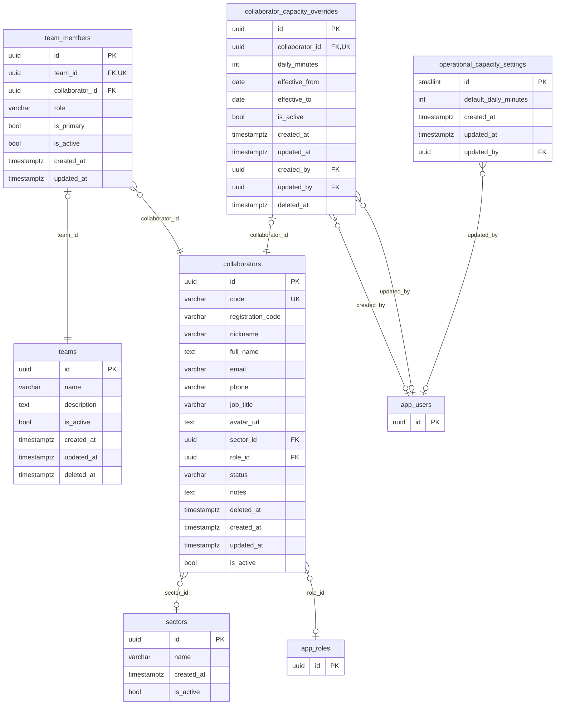
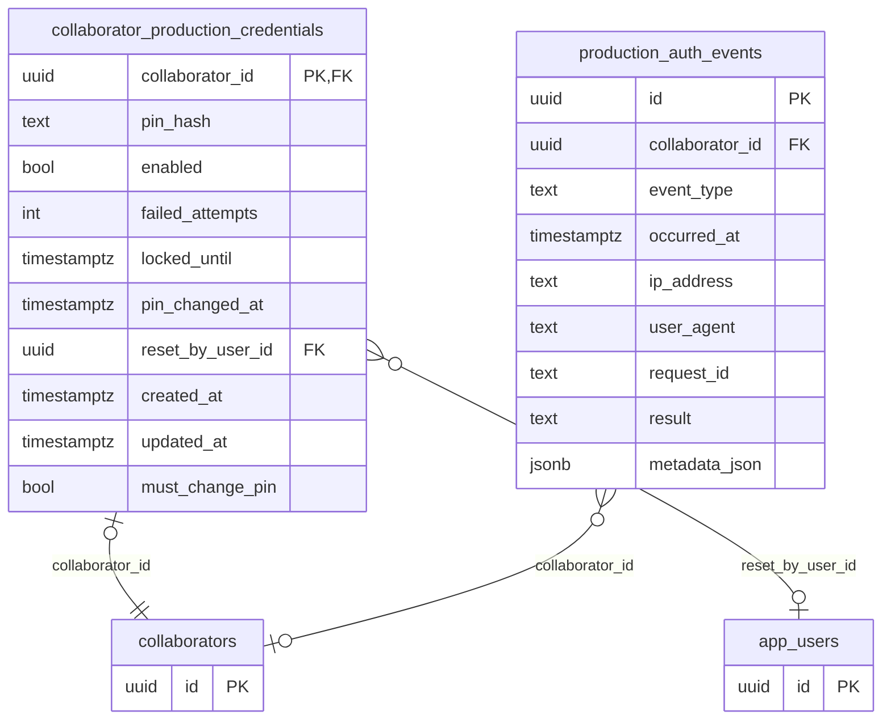
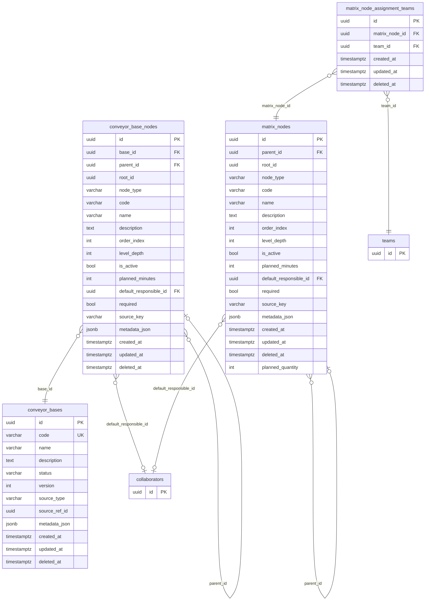
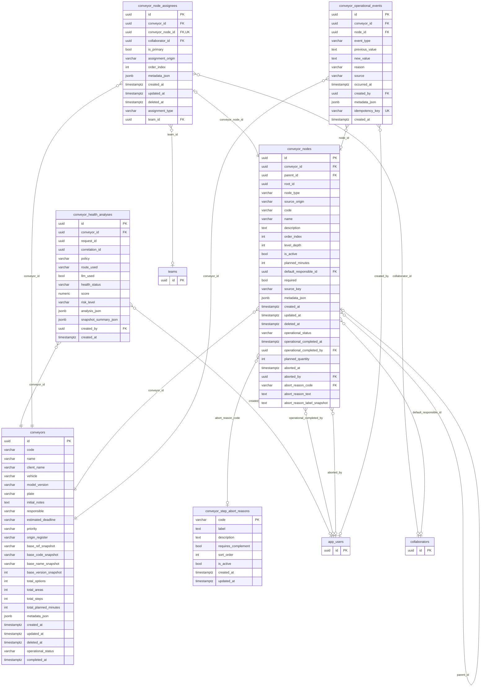
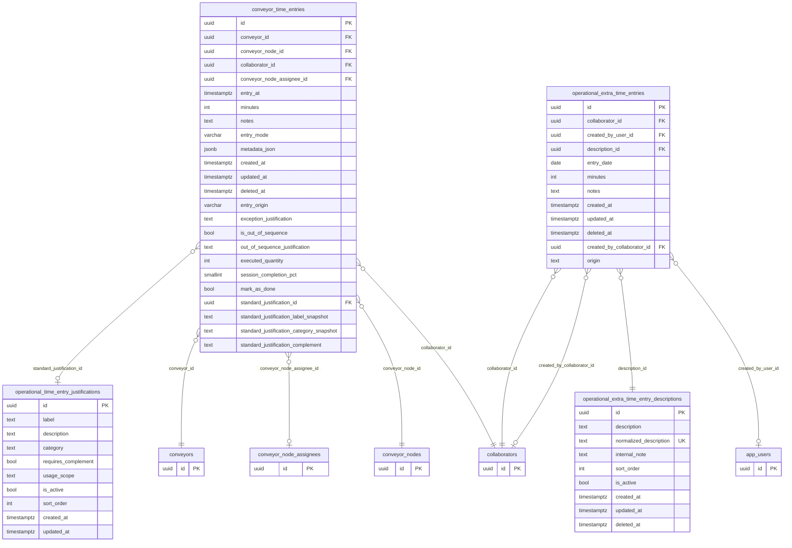
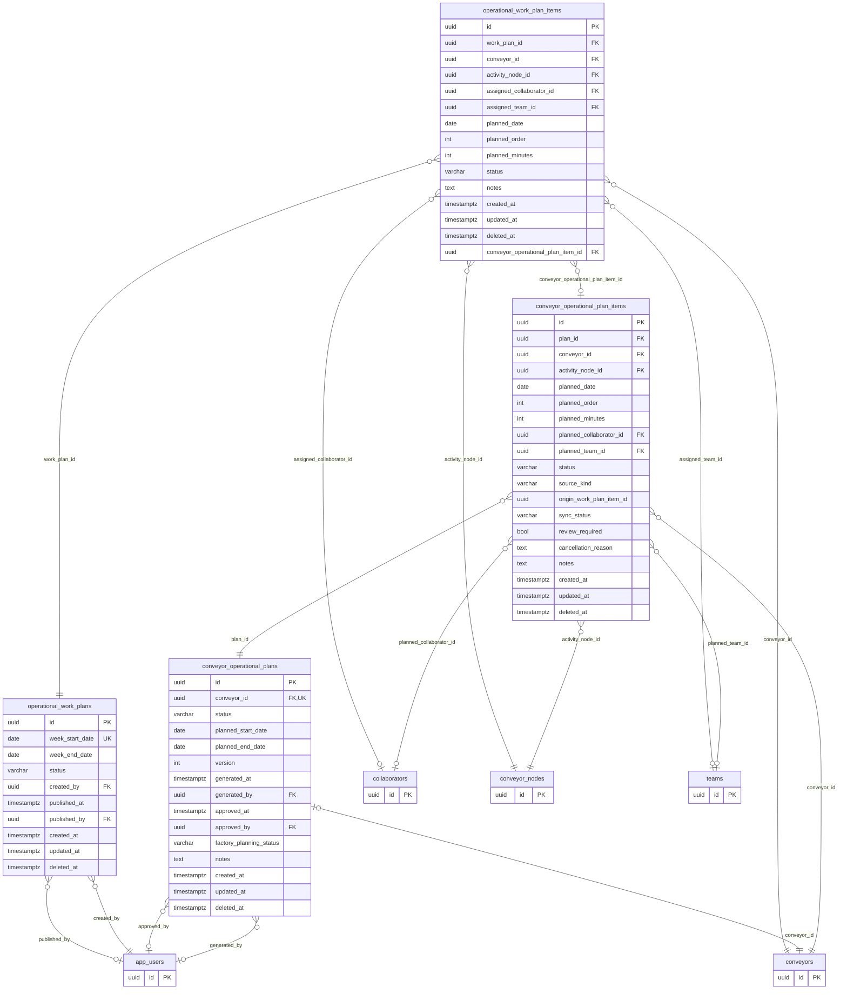
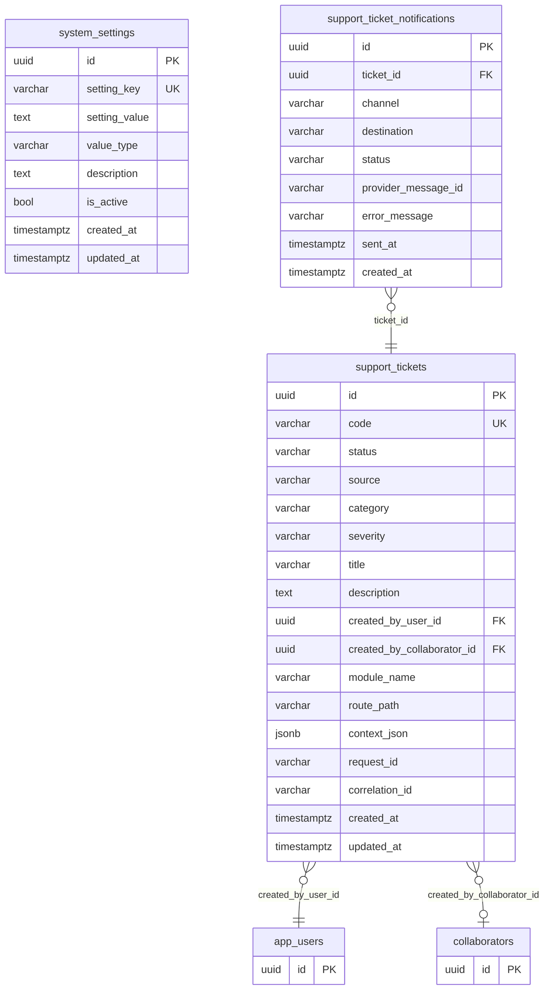

# SGP+ — Modelo de dados (PostgreSQL)

> Gerado a partir do schema real obtido aplicando as migrations `0001` a `0052` em um PostgreSQL 16 limpo. 34 tabelas, 70 chaves estrangeiras. Schema `public`, extensão `uuid-ossp`.

**Legenda de cardinalidade (Mermaid):** `}o--||` N:1 obrigatório · `}o--o|` N:1 opcional · `|o--||` 1:1.

## Visão geral por domínio

| Domínio | Tabelas | Descrição |
|---|---|---|
| Acesso & RBAC | `app_users`, `app_roles`, `app_permissions`, `app_role_permissions`, `admin_audit_events` | Usuários do app web, papéis, permissões e auditoria administrativa. |
| Pessoas & Equipes | `collaborators`, `sectors`, `teams`, `team_members`, `collaborator_capacity_overrides`, `operational_capacity_settings` | Colaboradores, setores, times e capacidade diária de trabalho. |
| Modo Fábrica / Kiosk | `collaborator_production_credentials`, `production_auth_events` | Credencial por PIN (Argon2id) e trilha de login do SGP+ Produção. |
| Matriz & Bases | `matrix_nodes`, `matrix_node_assignment_teams`, `conveyor_bases`, `conveyor_base_nodes` | Catálogo de operações (matriz) e bases reutilizáveis de onde as esteiras são montadas. |
| Esteiras | `conveyors`, `conveyor_nodes`, `conveyor_node_assignees`, `conveyor_step_abort_reasons`, `conveyor_operational_events`, `conveyor_health_analyses` | Esteira por veículo/OS, sua árvore de nós, designações, eventos e saúde. |
| Apontamentos | `conveyor_time_entries`, `operational_time_entry_justifications`, `operational_extra_time_entries`, `operational_extra_time_entry_descriptions` | Tempo apontado em atividades (STEP) e fora de esteira, com catálogos de justificativa. |
| Planejamento | `conveyor_operational_plans`, `conveyor_operational_plan_items`, `operational_work_plans`, `operational_work_plan_items` | Plano operacional da vida da esteira e planejamento semanal da fábrica. |
| Sistema & Suporte | `system_settings`, `support_tickets`, `support_ticket_notifications` | Parâmetros globais e tickets de suporte. |

## Mapa de relacionamentos (todas as tabelas)

```mermaid
erDiagram
    admin_audit_events
    app_permissions
    app_role_permissions
    app_roles
    app_users
    collaborator_capacity_overrides
    collaborator_production_credentials
    collaborators
    conveyor_base_nodes
    conveyor_bases
    conveyor_health_analyses
    conveyor_node_assignees
    conveyor_nodes
    conveyor_operational_events
    conveyor_operational_plan_items
    conveyor_operational_plans
    conveyor_step_abort_reasons
    conveyor_time_entries
    conveyors
    matrix_node_assignment_teams
    matrix_nodes
    operational_capacity_settings
    operational_extra_time_entries
    operational_extra_time_entry_descriptions
    operational_time_entry_justifications
    operational_work_plan_items
    operational_work_plans
    production_auth_events
    sectors
    support_ticket_notifications
    support_tickets
    system_settings
    team_members
    teams
    admin_audit_events }o--o| app_users : actor_user_id
    admin_audit_events }o--o| app_users : target_user_id
    admin_audit_events }o--o| collaborators : target_collaborator_id
    app_role_permissions }o--|| app_roles : role_id
    app_role_permissions }o--|| app_permissions : permission_id
    app_users |o--o| collaborators : collaborator_id
    app_users }o--o| app_roles : role_id
    app_users }o--o| app_users : created_by
    app_users }o--o| app_users : updated_by
    collaborator_capacity_overrides |o--|| collaborators : collaborator_id
    collaborator_capacity_overrides }o--o| app_users : created_by
    collaborator_capacity_overrides }o--o| app_users : updated_by
    collaborator_production_credentials |o--|| collaborators : collaborator_id
    collaborator_production_credentials }o--o| app_users : reset_by_user_id
    collaborators }o--o| sectors : sector_id
    collaborators }o--o| app_roles : role_id
    conveyor_base_nodes }o--|| conveyor_bases : base_id
    conveyor_base_nodes }o--o| conveyor_base_nodes : parent_id
    conveyor_base_nodes }o--o| collaborators : default_responsible_id
    conveyor_health_analyses }o--|| conveyors : conveyor_id
    conveyor_health_analyses }o--o| app_users : created_by
    conveyor_node_assignees }o--|| conveyors : conveyor_id
    conveyor_node_assignees |o--|| conveyor_nodes : conveyor_node_id
    conveyor_node_assignees }o--o| collaborators : collaborator_id
    conveyor_node_assignees }o--o| teams : team_id
    conveyor_nodes }o--|| conveyors : conveyor_id
    conveyor_nodes }o--o| conveyor_nodes : parent_id
    conveyor_nodes }o--o| collaborators : default_responsible_id
    conveyor_nodes }o--o| app_users : operational_completed_by
    conveyor_nodes }o--o| app_users : aborted_by
    conveyor_nodes }o--o| conveyor_step_abort_reasons : abort_reason_code
    conveyor_operational_events }o--|| conveyors : conveyor_id
    conveyor_operational_events }o--o| conveyor_nodes : node_id
    conveyor_operational_events }o--o| app_users : created_by
    conveyor_operational_plan_items }o--|| conveyor_operational_plans : plan_id
    conveyor_operational_plan_items }o--|| conveyors : conveyor_id
    conveyor_operational_plan_items }o--|| conveyor_nodes : activity_node_id
    conveyor_operational_plan_items }o--o| collaborators : planned_collaborator_id
    conveyor_operational_plan_items }o--o| teams : planned_team_id
    conveyor_operational_plans |o--|| conveyors : conveyor_id
    conveyor_operational_plans }o--o| app_users : generated_by
    conveyor_operational_plans }o--o| app_users : approved_by
    conveyor_time_entries }o--|| conveyor_nodes : conveyor_node_id
    conveyor_time_entries }o--|| collaborators : collaborator_id
    conveyor_time_entries }o--o| conveyor_node_assignees : conveyor_node_assignee_id
    conveyor_time_entries }o--|| conveyors : conveyor_id
    conveyor_time_entries }o--o| operational_time_entry_justifications : standard_justification_id
    matrix_node_assignment_teams }o--|| matrix_nodes : matrix_node_id
    matrix_node_assignment_teams }o--|| teams : team_id
    matrix_nodes }o--o| matrix_nodes : parent_id
    matrix_nodes }o--o| collaborators : default_responsible_id
    operational_capacity_settings }o--o| app_users : updated_by
    operational_extra_time_entries }o--o| app_users : created_by_user_id
    operational_extra_time_entries }o--|| collaborators : collaborator_id
    operational_extra_time_entries }o--|| operational_extra_time_entry_descriptions : description_id
    operational_extra_time_entries }o--o| collaborators : created_by_collaborator_id
    operational_work_plan_items }o--|| operational_work_plans : work_plan_id
    operational_work_plan_items }o--|| conveyors : conveyor_id
    operational_work_plan_items }o--|| conveyor_nodes : activity_node_id
    operational_work_plan_items }o--o| collaborators : assigned_collaborator_id
    operational_work_plan_items }o--o| teams : assigned_team_id
    operational_work_plan_items }o--o| conveyor_operational_plan_items : conveyor_operational_plan_item_id
    operational_work_plans }o--|| app_users : created_by
    operational_work_plans }o--o| app_users : published_by
    production_auth_events }o--o| collaborators : collaborator_id
    support_ticket_notifications }o--|| support_tickets : ticket_id
    support_tickets }o--|| app_users : created_by_user_id
    support_tickets }o--o| collaborators : created_by_collaborator_id
    team_members |o--|| teams : team_id
    team_members }o--|| collaborators : collaborator_id
```

## Relações lógicas (sem FK declarada)

| Tabela | Coluna | Aponta para | Observação |
|---|---|---|---|
| `conveyor_nodes` | `root_id` | `conveyor_nodes` | Aponta para o OPTION raiz da árvore (sem FK). |
| `conveyor_base_nodes` | `root_id` | `conveyor_base_nodes` | Aponta para o OPTION raiz da árvore (sem FK). |
| `matrix_nodes` | `root_id` | `matrix_nodes` | Aponta para o ITEM raiz da árvore (sem FK). |
| `conveyor_operational_plan_items` | `origin_work_plan_item_id` | `operational_work_plan_items` | Rastreabilidade de origem (sem FK). |
| `conveyors` | `base_*_snapshot` | `conveyor_bases` | Cópia textual da base usada na criação (snapshot, sem FK). |
| `conveyor_bases` | `source_ref_id` | `matrix_nodes / conveyors` | Origem conforme source_type (sem FK). |

## Acesso & RBAC

Usuários do app web, papéis, permissões e auditoria administrativa.

### `app_users`

Login do app web (e-mail + senha). Opcionalmente vinculado a 1 colaborador. Lockout e reset de senha.

| Coluna | Tipo | Nulo | Padrão | Chave / Domínio |
|---|---|---|---|---|
| `id` | uuid | não | `uuid_generate_v4()` | PK |
| `email` | varchar(256) | não |  |  |
| `created_at` | timestamptz | não | `now()` |  |
| `password_hash` | text | sim |  |  |
| `collaborator_id` | uuid | sim |  | FK → `collaborators.id` · UK |
| `role_id` | uuid | sim |  | FK → `app_roles.id` |
| `is_active` | boolean | não | `true` |  |
| `last_login_at` | timestamptz | sim |  |  |
| `updated_at` | timestamptz | não | `now()` |  |
| `created_by` | uuid | sim |  | FK → `app_users.id` |
| `updated_by` | uuid | sim |  | FK → `app_users.id` |
| `deleted_at` | timestamptz | sim |  |  |
| `avatar_url` | text | sim |  |  |
| `password_changed_at` | timestamptz | sim |  |  |
| `must_change_password` | boolean | não | `false` |  |
| `failed_login_count` | integer | não | `0` |  |
| `locked_until` | timestamptz | sim |  |  |
| `password_reset_token_hash` | text | sim |  |  |
| `password_reset_expires_at` | timestamptz | sim |  |  |

**Regras**

- Único: `(lower(btrim(email)))`
- Único: `(collaborator_id) WHERE (collaborator_id IS NOT NULL)`
- ON DELETE: `collaborator_id` SET NULL, `role_id` RESTRICT, `created_by` SET NULL, `updated_by` SET NULL

### `app_roles`

Papéis de acesso (ex.: ADMIN, GESTOR, COLABORADOR). Também usados como função do colaborador.

| Coluna | Tipo | Nulo | Padrão | Chave / Domínio |
|---|---|---|---|---|
| `id` | uuid | não | `uuid_generate_v4()` | PK |
| `code` | varchar(32) | não |  | UK |
| `name` | varchar(128) | não |  |  |
| `created_at` | timestamptz | não | `now()` |  |
| `is_active` | boolean | não | `true` |  |
| `is_collaborator_function` | boolean | não | `false` |  |

### `app_permissions`

Catálogo de códigos de permissão verificados pelos guards.

| Coluna | Tipo | Nulo | Padrão | Chave / Domínio |
|---|---|---|---|---|
| `id` | uuid | não | `gen_random_uuid()` | PK |
| `code` | varchar(128) | não |  | UK |
| `name` | varchar(256) | não |  |  |
| `created_at` | timestamptz | não | `now()` |  |

### `app_role_permissions`

N:N entre papéis e permissões.

| Coluna | Tipo | Nulo | Padrão | Chave / Domínio |
|---|---|---|---|---|
| `role_id` | uuid | não |  | PK · FK → `app_roles.id` |
| `permission_id` | uuid | não |  | PK · FK → `app_permissions.id` |

**Regras**

- ON DELETE: `role_id` CASCADE, `permission_id` CASCADE

### `admin_audit_events`

Auditoria administrativa (criação/edição de usuário, vínculos). Sem segredos.

| Coluna | Tipo | Nulo | Padrão | Chave / Domínio |
|---|---|---|---|---|
| `id` | uuid | não | `gen_random_uuid()` | PK |
| `event_type` | text | não |  |  |
| `actor_user_id` | uuid | sim |  | FK → `app_users.id` |
| `target_user_id` | uuid | sim |  | FK → `app_users.id` |
| `target_collaborator_id` | uuid | sim |  | FK → `collaborators.id` |
| `occurred_at` | timestamptz | não | `now()` |  |
| `result_status` | text | não | `'success'` |  |
| `metadata_json` | jsonb | sim |  |  |

**Regras**

- ON DELETE: `actor_user_id` SET NULL, `target_user_id` SET NULL, `target_collaborator_id` SET NULL

## Pessoas & Equipes

Colaboradores, setores, times e capacidade diária de trabalho.

### `collaborators`

Pessoa que executa o trabalho físico. Centro do modelo de pessoas.

| Coluna | Tipo | Nulo | Padrão | Chave / Domínio |
|---|---|---|---|---|
| `id` | uuid | não | `uuid_generate_v4()` | PK |
| `code` | varchar(64) | sim |  | UK |
| `registration_code` | varchar(64) | sim |  |  |
| `nickname` | varchar(256) | sim |  |  |
| `full_name` | text | não |  |  |
| `email` | varchar(256) | sim |  |  |
| `phone` | varchar(64) | sim |  |  |
| `job_title` | varchar(256) | sim |  |  |
| `avatar_url` | text | sim |  |  |
| `sector_id` | uuid | sim |  | FK → `sectors.id` |
| `role_id` | uuid | sim |  | FK → `app_roles.id` |
| `status` | varchar(16) | não | `'ACTIVE'` | ACTIVE \| INACTIVE |
| `notes` | text | sim |  |  |
| `deleted_at` | timestamptz | sim |  |  |
| `created_at` | timestamptz | não | `now()` |  |
| `updated_at` | timestamptz | não | `now()` |  |
| `is_active` | boolean | não | `true` |  |

**Regras**

- Único: `(code) WHERE ((code IS NOT NULL) AND (deleted_at IS NULL))`
- Único: `(lower(btrim(full_name))) WHERE (deleted_at IS NULL)`
- `CHECK ((is_active = ((status) = 'ACTIVE')))`
- ON DELETE: `sector_id` SET NULL, `role_id` SET NULL

### `sectors`

Setor operacional (ex.: Funilaria, Elétrica).

| Coluna | Tipo | Nulo | Padrão | Chave / Domínio |
|---|---|---|---|---|
| `id` | uuid | não | `uuid_generate_v4()` | PK |
| `name` | varchar(256) | não |  |  |
| `created_at` | timestamptz | não | `now()` |  |
| `is_active` | boolean | não | `true` |  |

### `teams`

Time de colaboradores, designável a atividades como unidade.

| Coluna | Tipo | Nulo | Padrão | Chave / Domínio |
|---|---|---|---|---|
| `id` | uuid | não | `uuid_generate_v4()` | PK |
| `name` | varchar(256) | não |  |  |
| `description` | text | sim |  |  |
| `is_active` | boolean | não | `true` |  |
| `created_at` | timestamptz | não | `now()` |  |
| `updated_at` | timestamptz | não | `now()` |  |
| `deleted_at` | timestamptz | sim |  |  |

### `team_members`

Membros do time (1 membro principal por time).

| Coluna | Tipo | Nulo | Padrão | Chave / Domínio |
|---|---|---|---|---|
| `id` | uuid | não | `uuid_generate_v4()` | PK |
| `team_id` | uuid | não |  | FK → `teams.id` · UK |
| `collaborator_id` | uuid | não |  | FK → `collaborators.id` |
| `role` | varchar(128) | sim |  |  |
| `is_primary` | boolean | não | `false` |  |
| `is_active` | boolean | não | `true` |  |
| `created_at` | timestamptz | não | `now()` |  |
| `updated_at` | timestamptz | não | `now()` |  |

**Regras**

- Único: `(team_id, collaborator_id) WHERE (is_active = true)`
- Único: `(team_id) WHERE ((is_primary = true) AND (is_active = true))`
- ON DELETE: `team_id` CASCADE, `collaborator_id` RESTRICT

### `collaborator_capacity_overrides`

Minutos/dia específicos de um colaborador (sobrepõe o padrão).

| Coluna | Tipo | Nulo | Padrão | Chave / Domínio |
|---|---|---|---|---|
| `id` | uuid | não | `gen_random_uuid()` | PK |
| `collaborator_id` | uuid | não |  | FK → `collaborators.id` · UK |
| `daily_minutes` | integer | não |  |  |
| `effective_from` | date | sim |  |  |
| `effective_to` | date | sim |  |  |
| `is_active` | boolean | não | `true` |  |
| `created_at` | timestamptz | não | `now()` |  |
| `updated_at` | timestamptz | não | `now()` |  |
| `created_by` | uuid | sim |  | FK → `app_users.id` |
| `updated_by` | uuid | sim |  | FK → `app_users.id` |
| `deleted_at` | timestamptz | sim |  |  |

**Regras**

- Único: `(collaborator_id) WHERE ((deleted_at IS NULL) AND (is_active = true))`
- `CHECK (((daily_minutes > 0) AND (daily_minutes <= 1440)))`
- `CHECK (((effective_to IS NULL) OR (effective_from IS NULL) OR (effective_to >= effective_from)))`
- ON DELETE: `collaborator_id` RESTRICT, `created_by` SET NULL, `updated_by` SET NULL

### `operational_capacity_settings`

Linha única (id = 1) com a capacidade diária padrão da fábrica.

| Coluna | Tipo | Nulo | Padrão | Chave / Domínio |
|---|---|---|---|---|
| `id` | smallint | não | `1` | PK |
| `default_daily_minutes` | integer | não |  |  |
| `created_at` | timestamptz | não | `now()` |  |
| `updated_at` | timestamptz | não | `now()` |  |
| `updated_by` | uuid | sim |  | FK → `app_users.id` |

**Regras**

- `CHECK (id = 1)`
- `CHECK (((default_daily_minutes > 0) AND (default_daily_minutes <= 1440)))`
- ON DELETE: `updated_by` SET NULL

## Modo Fábrica / Kiosk

Credencial por PIN (Argon2id) e trilha de login do SGP+ Produção.

### `collaborator_production_credentials`

PIN do Modo Fábrica em hash Argon2id, tentativas, bloqueio e troca obrigatória. 1:1 com colaborador.

| Coluna | Tipo | Nulo | Padrão | Chave / Domínio |
|---|---|---|---|---|
| `collaborator_id` | uuid | não |  | PK · FK → `collaborators.id` |
| `pin_hash` | text | não |  |  |
| `enabled` | boolean | não | `false` |  |
| `failed_attempts` | integer | não | `0` |  |
| `locked_until` | timestamptz | sim |  |  |
| `pin_changed_at` | timestamptz | sim |  |  |
| `reset_by_user_id` | uuid | sim |  | FK → `app_users.id` |
| `created_at` | timestamptz | não | `now()` |  |
| `updated_at` | timestamptz | não | `now()` |  |
| `must_change_pin` | boolean | não | `false` |  |

**Regras**

- `CHECK (failed_attempts >= 0)`
- ON DELETE: `collaborator_id` CASCADE, `reset_by_user_id` SET NULL

### `production_auth_events`

Login, logout e falhas do Modo Fábrica / Kiosk.

| Coluna | Tipo | Nulo | Padrão | Chave / Domínio |
|---|---|---|---|---|
| `id` | uuid | não | `gen_random_uuid()` | PK |
| `collaborator_id` | uuid | sim |  | FK → `collaborators.id` |
| `event_type` | text | não |  | PRODUCTION_LOGIN_SUCCESS \| PRODUCTION_LOGIN_FAILURE \| PRODUCTION_LOGOUT \| PRODUCTION_SESSION_REJECTED |
| `occurred_at` | timestamptz | não | `now()` |  |
| `ip_address` | text | sim |  |  |
| `user_agent` | text | sim |  |  |
| `request_id` | text | sim |  |  |
| `result` | text | sim |  |  |
| `metadata_json` | jsonb | não | `'{}'::jsonb` |  |

**Regras**

- ON DELETE: `collaborator_id` SET NULL

## Matriz & Bases

Catálogo de operações (matriz) e bases reutilizáveis de onde as esteiras são montadas.

### `matrix_nodes`

Matriz de operações: árvore ITEM → TASK → SECTOR → ACTIVITY com tempo padrão.

| Coluna | Tipo | Nulo | Padrão | Chave / Domínio |
|---|---|---|---|---|
| `id` | uuid | não | `uuid_generate_v4()` | PK |
| `parent_id` | uuid | sim |  | FK → `matrix_nodes.id` |
| `root_id` | uuid | não |  |  |
| `node_type` | varchar(20) | não |  | ITEM \| TASK \| SECTOR \| ACTIVITY |
| `code` | varchar(50) | sim |  |  |
| `name` | varchar(150) | não |  |  |
| `description` | text | sim |  |  |
| `order_index` | integer | não | `0` |  |
| `level_depth` | integer | não | `0` |  |
| `is_active` | boolean | não | `true` |  |
| `planned_minutes` | integer | sim |  |  |
| `default_responsible_id` | uuid | sim |  | FK → `collaborators.id` |
| `required` | boolean | não | `true` |  |
| `source_key` | varchar(100) | sim |  |  |
| `metadata_json` | jsonb | sim |  |  |
| `created_at` | timestamptz | não | `now()` |  |
| `updated_at` | timestamptz | não | `now()` |  |
| `deleted_at` | timestamptz | sim |  |  |
| `planned_quantity` | integer | não | `1` |  |

**Regras**

- `CHECK (((((node_type) = 'ITEM') AND (parent_id IS NULL)) OR (((node_type) <> 'ITEM') AND (parent_id IS NOT NULL))))`
- `CHECK (planned_quantity >= 1)`
- ON DELETE: `parent_id` RESTRICT, `default_responsible_id` SET NULL

### `matrix_node_assignment_teams`

Times sugeridos para um nó da matriz.

| Coluna | Tipo | Nulo | Padrão | Chave / Domínio |
|---|---|---|---|---|
| `id` | uuid | não | `uuid_generate_v4()` | PK |
| `matrix_node_id` | uuid | não |  | FK → `matrix_nodes.id` |
| `team_id` | uuid | não |  | FK → `teams.id` |
| `created_at` | timestamptz | não | `now()` |  |
| `updated_at` | timestamptz | não | `now()` |  |
| `deleted_at` | timestamptz | sim |  |  |

**Regras**

- Único: `(matrix_node_id, team_id) WHERE (deleted_at IS NULL)`
- ON DELETE: `matrix_node_id` CASCADE, `team_id` RESTRICT

### `conveyor_bases`

Modelo reutilizável de esteira, versionado.

| Coluna | Tipo | Nulo | Padrão | Chave / Domínio |
|---|---|---|---|---|
| `id` | uuid | não | `uuid_generate_v4()` | PK |
| `code` | varchar(64) | sim |  | UK |
| `name` | varchar(256) | não |  |  |
| `description` | text | sim |  |  |
| `status` | varchar(16) | não | `'DRAFT'` | DRAFT \| ACTIVE \| INACTIVE |
| `version` | integer | não | `1` |  |
| `source_type` | varchar(16) | não | `'MANUAL'` | MANUAL \| MATRIX \| CONVEYOR |
| `source_ref_id` | uuid | sim |  |  |
| `metadata_json` | jsonb | sim |  |  |
| `created_at` | timestamptz | não | `now()` |  |
| `updated_at` | timestamptz | não | `now()` |  |
| `deleted_at` | timestamptz | sim |  |  |

**Regras**

- Único: `(code) WHERE ((deleted_at IS NULL) AND (code IS NOT NULL))`
- `CHECK (version > 0)`

### `conveyor_base_nodes`

Árvore da base: OPTION → AREA → STEP.

| Coluna | Tipo | Nulo | Padrão | Chave / Domínio |
|---|---|---|---|---|
| `id` | uuid | não | `uuid_generate_v4()` | PK |
| `base_id` | uuid | não |  | FK → `conveyor_bases.id` |
| `parent_id` | uuid | sim |  | FK → `conveyor_base_nodes.id` |
| `root_id` | uuid | não |  |  |
| `node_type` | varchar(16) | não |  | OPTION \| AREA \| STEP |
| `code` | varchar(50) | sim |  |  |
| `name` | varchar(150) | não |  |  |
| `description` | text | sim |  |  |
| `order_index` | integer | não | `0` |  |
| `level_depth` | integer | não | `0` |  |
| `is_active` | boolean | não | `true` |  |
| `planned_minutes` | integer | sim |  |  |
| `default_responsible_id` | uuid | sim |  | FK → `collaborators.id` |
| `required` | boolean | não | `true` |  |
| `source_key` | varchar(100) | sim |  |  |
| `metadata_json` | jsonb | sim |  |  |
| `created_at` | timestamptz | não | `now()` |  |
| `updated_at` | timestamptz | não | `now()` |  |
| `deleted_at` | timestamptz | sim |  |  |

**Regras**

- `CHECK (order_index >= 0)`
- `CHECK (level_depth >= 0)`
- `CHECK (((planned_minutes IS NULL) OR (planned_minutes >= 0)))`
- `CHECK (((((node_type) = 'OPTION') AND (parent_id IS NULL)) OR (((node_type) <> 'OPTION') AND (parent_id IS NOT NULL))))`
- ON DELETE: `base_id` RESTRICT, `parent_id` RESTRICT, `default_responsible_id` SET NULL

## Esteiras

Esteira por veículo/OS, sua árvore de nós, designações, eventos e saúde.

### `conveyors`

Esteira de um veículo/OS: cliente, placa, prioridade, status do ciclo de vida e totais.

| Coluna | Tipo | Nulo | Padrão | Chave / Domínio |
|---|---|---|---|---|
| `id` | uuid | não | `uuid_generate_v4()` | PK |
| `code` | varchar(64) | sim |  |  |
| `name` | varchar(256) | não |  |  |
| `client_name` | varchar(256) | sim |  |  |
| `vehicle` | varchar(256) | sim |  |  |
| `model_version` | varchar(256) | sim |  |  |
| `plate` | varchar(32) | sim |  |  |
| `initial_notes` | text | sim |  |  |
| `responsible` | varchar(256) | sim |  |  |
| `estimated_deadline` | varchar(128) | sim |  |  |
| `priority` | varchar(16) | não |  | alta \| media \| baixa |
| `origin_register` | varchar(16) | não |  | MANUAL \| BASE \| HYBRID |
| `base_ref_snapshot` | varchar(128) | sim |  |  |
| `base_code_snapshot` | varchar(64) | sim |  |  |
| `base_name_snapshot` | varchar(256) | sim |  |  |
| `base_version_snapshot` | integer | sim |  |  |
| `total_options` | integer | não |  |  |
| `total_areas` | integer | não |  |  |
| `total_steps` | integer | não |  |  |
| `total_planned_minutes` | integer | não |  |  |
| `metadata_json` | jsonb | sim |  |  |
| `created_at` | timestamptz | não | `now()` |  |
| `updated_at` | timestamptz | não | `now()` |  |
| `deleted_at` | timestamptz | sim |  |  |
| `operational_status` | varchar(32) | não | `'EM_ELABORACAO'` | EM_ELABORACAO \| AGUARDANDO_PLANEJAMENTO \| EM_PLANEJAMENTO \| A_INICIAR \| EM_ANDAMENTO \| FINALIZADA \| CANCELADA |
| `completed_at` | timestamptz | sim |  |  |

**Regras**

- `CHECK (((total_options >= 0) AND (total_areas >= 0) AND (total_steps >= 0) AND (total_planned_minutes >= 0)))`

### `conveyor_nodes`

Árvore da esteira: OPTION (Tarefa) → AREA (Setor) → STEP (Atividade apontável), com status, quantidade planejada e dispensa.

| Coluna | Tipo | Nulo | Padrão | Chave / Domínio |
|---|---|---|---|---|
| `id` | uuid | não | `uuid_generate_v4()` | PK |
| `conveyor_id` | uuid | não |  | FK → `conveyors.id` |
| `parent_id` | uuid | sim |  | FK → `conveyor_nodes.id` |
| `root_id` | uuid | não |  |  |
| `node_type` | varchar(16) | não |  | OPTION \| AREA \| STEP |
| `source_origin` | varchar(20) | não |  | manual \| reaproveitada \| base |
| `code` | varchar(50) | sim |  |  |
| `name` | varchar(150) | não |  |  |
| `description` | text | sim |  |  |
| `order_index` | integer | não | `0` |  |
| `level_depth` | integer | não | `0` |  |
| `is_active` | boolean | não | `true` |  |
| `planned_minutes` | integer | sim |  |  |
| `default_responsible_id` | uuid | sim |  | FK → `collaborators.id` |
| `required` | boolean | não | `true` |  |
| `source_key` | varchar(100) | sim |  |  |
| `metadata_json` | jsonb | sim |  |  |
| `created_at` | timestamptz | não | `now()` |  |
| `updated_at` | timestamptz | não | `now()` |  |
| `deleted_at` | timestamptz | sim |  |  |
| `operational_status` | varchar(32) | sim |  |  |
| `operational_completed_at` | timestamptz | sim |  |  |
| `operational_completed_by` | uuid | sim |  | FK → `app_users.id` |
| `planned_quantity` | integer | não | `1` |  |
| `aborted_at` | timestamptz | sim |  |  |
| `aborted_by` | uuid | sim |  | FK → `app_users.id` |
| `abort_reason_code` | varchar(64) | sim |  | FK → `conveyor_step_abort_reasons.code` |
| `abort_reason_text` | text | sim |  |  |
| `abort_reason_label_snapshot` | text | sim |  |  |

**Regras**

- `CHECK (order_index >= 0)`
- `CHECK (level_depth >= 0)`
- `CHECK (((planned_minutes IS NULL) OR (planned_minutes >= 0)))`
- `CHECK (((((node_type) = 'OPTION') AND (parent_id IS NULL)) OR (((node_type) <> 'OPTION') AND (parent_id IS NOT NULL))))`
- `CHECK (planned_quantity >= 1)`
- `CHECK (((((node_type) = 'STEP') AND (operational_status IS NOT NULL) AND ((operational_status) = ANY (['PENDING', 'IN_PROGRESS', 'BLOCKED', 'COMPLETED', 'REOPENED', 'ABORTED']))) OR (((node_type) <> 'STEP') AND (operational_status IS NULL))))`
- ON DELETE: `conveyor_id` CASCADE, `parent_id` RESTRICT, `default_responsible_id` SET NULL, `operational_completed_by` SET NULL, `aborted_by` SET NULL, `abort_reason_code` RESTRICT

### `conveyor_node_assignees`

Quem executa cada nó: um colaborador OU um time (1 responsável principal por nó).

| Coluna | Tipo | Nulo | Padrão | Chave / Domínio |
|---|---|---|---|---|
| `id` | uuid | não | `uuid_generate_v4()` | PK |
| `conveyor_id` | uuid | não |  | FK → `conveyors.id` |
| `conveyor_node_id` | uuid | não |  | FK → `conveyor_nodes.id` · UK |
| `collaborator_id` | uuid | sim |  | FK → `collaborators.id` |
| `is_primary` | boolean | não | `false` |  |
| `assignment_origin` | varchar(20) | não | `'manual'` | manual \| base \| reaproveitada |
| `order_index` | integer | não | `0` |  |
| `metadata_json` | jsonb | sim |  |  |
| `created_at` | timestamptz | não | `now()` |  |
| `updated_at` | timestamptz | não | `now()` |  |
| `deleted_at` | timestamptz | sim |  |  |
| `assignment_type` | varchar(20) | não | `'COLLABORATOR'` |  |
| `team_id` | uuid | sim |  | FK → `teams.id` |

**Regras**

- Único: `(conveyor_node_id, collaborator_id) WHERE ((deleted_at IS NULL) AND ((assignment_type) = 'COLLABORATOR'))`
- Único: `(conveyor_node_id, team_id) WHERE ((deleted_at IS NULL) AND ((assignment_type) = 'TEAM'))`
- Único: `(conveyor_node_id) WHERE ((deleted_at IS NULL) AND ((assignment_type) = 'COLLABORATOR') AND (is_primary = true))`
- `CHECK (order_index >= 0)`
- `CHECK (((((assignment_type) = 'COLLABORATOR') AND (collaborator_id IS NOT NULL) AND (team_id IS NULL)) OR (((assignment_type) = 'TEAM') AND (team_id IS NOT NULL) AND (collaborator_id IS NULL))))`
- `CHECK ((((assignment_type) <> 'TEAM') OR (is_primary = false)))`
- Trigger tr_conveyor_node_assignees_biud (fn_validate_conveyor_node_assignee_row): valida coerência do nó/esteira na designação.
- ON DELETE: `conveyor_id` RESTRICT, `conveyor_node_id` RESTRICT, `collaborator_id` RESTRICT, `team_id` RESTRICT

### `conveyor_step_abort_reasons`

Catálogo de motivos para dispensar uma atividade (PK = code).

| Coluna | Tipo | Nulo | Padrão | Chave / Domínio |
|---|---|---|---|---|
| `code` | varchar(64) | não |  | PK |
| `label` | text | não |  |  |
| `description` | text | sim |  |  |
| `requires_complement` | boolean | não | `false` |  |
| `sort_order` | integer | não | `100` |  |
| `is_active` | boolean | não | `true` |  |
| `created_at` | timestamptz | não | `now()` |  |
| `updated_at` | timestamptz | não | `now()` |  |

**Regras**

- `CHECK (((code) ~ '^[A-Z0-9_]+$'))`
- `CHECK ((length(btrim(label)) > 0))`
- `CHECK (sort_order >= 0)`

### `conveyor_operational_events`

Linha do tempo operacional da esteira/nó (mudanças de status etc.), idempotente.

| Coluna | Tipo | Nulo | Padrão | Chave / Domínio |
|---|---|---|---|---|
| `id` | uuid | não | `gen_random_uuid()` | PK |
| `conveyor_id` | uuid | não |  | FK → `conveyors.id` |
| `node_id` | uuid | sim |  | FK → `conveyor_nodes.id` |
| `event_type` | varchar(80) | não |  |  |
| `previous_value` | text | sim |  |  |
| `new_value` | text | sim |  |  |
| `reason` | varchar(120) | sim |  |  |
| `source` | varchar(80) | não |  |  |
| `occurred_at` | timestamptz | não |  |  |
| `created_by` | uuid | sim |  | FK → `app_users.id` |
| `metadata_json` | jsonb | sim |  |  |
| `idempotency_key` | varchar(180) | sim |  | UK |
| `created_at` | timestamptz | não | `now()` |  |

**Regras**

- Único: `(idempotency_key) WHERE (idempotency_key IS NOT NULL)`
- `CHECK ((btrim(event_type) <> ''))`
- `CHECK ((btrim(source) <> ''))`
- ON DELETE: `conveyor_id` CASCADE, `node_id` CASCADE, `created_by` SET NULL

### `conveyor_health_analyses`

Análises de saúde da esteira (score, risco, JSON da análise).

| Coluna | Tipo | Nulo | Padrão | Chave / Domínio |
|---|---|---|---|---|
| `id` | uuid | não | `gen_random_uuid()` | PK |
| `conveyor_id` | uuid | não |  | FK → `conveyors.id` |
| `request_id` | uuid | não |  |  |
| `correlation_id` | uuid | não |  |  |
| `policy` | varchar(20) | não |  |  |
| `route_used` | varchar(50) | sim |  |  |
| `llm_used` | boolean | sim |  |  |
| `health_status` | varchar(50) | sim |  |  |
| `score` | numeric | sim |  |  |
| `risk_level` | varchar(50) | sim |  |  |
| `analysis_json` | jsonb | não |  |  |
| `snapshot_summary_json` | jsonb | sim |  |  |
| `created_by` | uuid | sim |  | FK → `app_users.id` |
| `created_at` | timestamptz | não | `now()` |  |

**Regras**

- ON DELETE: `conveyor_id` CASCADE, `created_by` SET NULL

## Apontamentos

Tempo apontado em atividades (STEP) e fora de esteira, com catálogos de justificativa.

### `conveyor_time_entries`

Apontamento de tempo em um STEP: minutos, quantidade executada, % de conclusão, exceções e fora de sequência.

| Coluna | Tipo | Nulo | Padrão | Chave / Domínio |
|---|---|---|---|---|
| `id` | uuid | não | `uuid_generate_v4()` | PK |
| `conveyor_id` | uuid | não |  | FK → `conveyors.id` |
| `conveyor_node_id` | uuid | não |  | FK → `conveyor_nodes.id` |
| `collaborator_id` | uuid | não |  | FK → `collaborators.id` |
| `conveyor_node_assignee_id` | uuid | sim |  | FK → `conveyor_node_assignees.id` |
| `entry_at` | timestamptz | não | `now()` |  |
| `minutes` | integer | não |  |  |
| `notes` | text | sim |  |  |
| `entry_mode` | varchar(20) | não | `'manual'` | manual \| guided \| imported |
| `metadata_json` | jsonb | sim |  |  |
| `created_at` | timestamptz | não | `now()` |  |
| `updated_at` | timestamptz | não | `now()` |  |
| `deleted_at` | timestamptz | sim |  |  |
| `entry_origin` | varchar(32) | não | `'ASSIGNED'` | ASSIGNED \| UNASSIGNED_EXCEPTION |
| `exception_justification` | text | sim |  |  |
| `is_out_of_sequence` | boolean | não | `false` |  |
| `out_of_sequence_justification` | text | sim |  |  |
| `executed_quantity` | integer | sim |  |  |
| `session_completion_pct` | smallint | sim |  |  |
| `mark_as_done` | boolean | não | `false` |  |
| `standard_justification_id` | uuid | sim |  | FK → `operational_time_entry_justifications.id` |
| `standard_justification_label_snapshot` | text | sim |  |  |
| `standard_justification_category_snapshot` | text | sim |  |  |
| `standard_justification_complement` | text | sim |  |  |

**Regras**

- `CHECK (minutes > 0)`
- `CHECK ((((entry_origin) <> 'ASSIGNED') OR (exception_justification IS NULL)))`
- `CHECK ((((entry_origin) <> 'UNASSIGNED_EXCEPTION') OR ((conveyor_node_assignee_id IS NULL) AND (exception_justification IS NOT NULL) AND (length(btrim(exception_justification)) > 0))))`
- `CHECK (((is_out_of_sequence = false) OR ((out_of_sequence_justification IS NOT NULL) AND (length(btrim(out_of_sequence_justification)) > 0))))`
- `CHECK (((is_out_of_sequence = true) OR (out_of_sequence_justification IS NULL)))`
- `CHECK (((executed_quantity IS NULL) OR (executed_quantity >= 0)))`
- `CHECK (((session_completion_pct IS NULL) OR ((session_completion_pct >= 0) AND (session_completion_pct <= 100))))`
- Trigger tr_conveyor_time_entries_biud (fn_validate_conveyor_time_entry_row): valida STEP, esteira e designação (inclusive via time).
- ON DELETE: `conveyor_node_id` RESTRICT, `collaborator_id` RESTRICT, `conveyor_node_assignee_id` SET NULL, `conveyor_id` RESTRICT, `standard_justification_id` NO ACTION

### `operational_time_entry_justifications`

Catálogo de justificativas padrão para apontamentos em exceção.

| Coluna | Tipo | Nulo | Padrão | Chave / Domínio |
|---|---|---|---|---|
| `id` | uuid | não | `gen_random_uuid()` | PK |
| `label` | text | não |  |  |
| `description` | text | sim |  |  |
| `category` | text | sim |  |  |
| `requires_complement` | boolean | não | `false` |  |
| `usage_scope` | text | sim |  |  |
| `is_active` | boolean | não | `true` |  |
| `sort_order` | integer | não | `0` |  |
| `created_at` | timestamptz | não | `now()` |  |
| `updated_at` | timestamptz | não | `now()` |  |

### `operational_extra_time_entries`

Tempo gasto fora de esteira (limpeza, reunião…), originado no WEB ou na PRODUCTION.

| Coluna | Tipo | Nulo | Padrão | Chave / Domínio |
|---|---|---|---|---|
| `id` | uuid | não | `gen_random_uuid()` | PK |
| `collaborator_id` | uuid | não |  | FK → `collaborators.id` |
| `created_by_user_id` | uuid | sim |  | FK → `app_users.id` |
| `description_id` | uuid | não |  | FK → `operational_extra_time_entry_descriptions.id` |
| `entry_date` | date | não | `CURRENT_DATE` |  |
| `minutes` | integer | não |  |  |
| `notes` | text | sim |  |  |
| `created_at` | timestamptz | não | `now()` |  |
| `updated_at` | timestamptz | não | `now()` |  |
| `deleted_at` | timestamptz | sim |  |  |
| `created_by_collaborator_id` | uuid | sim |  | FK → `collaborators.id` |
| `origin` | text | não | `'WEB'` | WEB \| PRODUCTION |

**Regras**

- `CHECK (minutes > 0)`
- `CHECK ((((origin = 'WEB') AND (created_by_user_id IS NOT NULL) AND (created_by_collaborator_id IS NULL)) OR ((origin = 'PRODUCTION') AND (created_by_collaborator_id IS NOT NULL) AND (created_by_user_id IS NULL))))`
- Trigger trg_validate_operational_extra_time_entry_description_active: exige descrição ativa.
- ON DELETE: `created_by_user_id` RESTRICT, `collaborator_id` RESTRICT, `description_id` RESTRICT, `created_by_collaborator_id` RESTRICT

### `operational_extra_time_entry_descriptions`

Catálogo de descrições para apontamento extra esteira.

| Coluna | Tipo | Nulo | Padrão | Chave / Domínio |
|---|---|---|---|---|
| `id` | uuid | não | `gen_random_uuid()` | PK |
| `description` | text | não |  |  |
| `normalized_description` | text | não |  | UK |
| `internal_note` | text | sim |  |  |
| `sort_order` | integer | não | `100` |  |
| `is_active` | boolean | não | `true` |  |
| `created_at` | timestamptz | não | `now()` |  |
| `updated_at` | timestamptz | não | `now()` |  |
| `deleted_at` | timestamptz | sim |  |  |

**Regras**

- Único: `(normalized_description) WHERE (deleted_at IS NULL)`

## Planejamento

Plano operacional da vida da esteira e planejamento semanal da fábrica.

### `conveyor_operational_plans`

Plano operacional da esteira (1 ativo por esteira), com aprovação e versão.

| Coluna | Tipo | Nulo | Padrão | Chave / Domínio |
|---|---|---|---|---|
| `id` | uuid | não | `gen_random_uuid()` | PK |
| `conveyor_id` | uuid | não |  | FK → `conveyors.id` · UK |
| `status` | varchar(40) | não |  | DRAFT \| APPROVED \| WAITING_FACTORY_PLANNING \| PARTIALLY_PLANNED_IN_FACTORY \| FULLY_PLANNED_IN_FACTORY \| IN_EXECUTION \| COMPLETED \| CANCELLED |
| `planned_start_date` | date | sim |  |  |
| `planned_end_date` | date | sim |  |  |
| `version` | integer | não | `1` |  |
| `generated_at` | timestamptz | sim |  |  |
| `generated_by` | uuid | sim |  | FK → `app_users.id` |
| `approved_at` | timestamptz | sim |  |  |
| `approved_by` | uuid | sim |  | FK → `app_users.id` |
| `factory_planning_status` | varchar(40) | sim |  |  |
| `notes` | text | sim |  |  |
| `created_at` | timestamptz | não | `now()` |  |
| `updated_at` | timestamptz | não | `now()` |  |
| `deleted_at` | timestamptz | sim |  |  |

**Regras**

- Único: `(conveyor_id) WHERE ((deleted_at IS NULL) AND ((status) <> ALL (['CANCELLED', 'COMPLETED'])))`
- `CHECK (((factory_planning_status IS NULL) OR ((factory_planning_status) = ANY (['NOT_SCHEDULED', 'PARTIALLY_SCHEDULED', 'FULLY_SCHEDULED', 'DIVERGED', 'REVIEW_REQUIRED']))))`
- `CHECK (version >= 1)`
- `CHECK (((planned_end_date IS NULL) OR (planned_start_date IS NULL) OR (planned_end_date >= planned_start_date)))`
- ON DELETE: `conveyor_id` RESTRICT, `generated_by` SET NULL, `approved_by` SET NULL

### `conveyor_operational_plan_items`

Atividades do plano da esteira: data, ordem, minutos, quem executa.

| Coluna | Tipo | Nulo | Padrão | Chave / Domínio |
|---|---|---|---|---|
| `id` | uuid | não | `gen_random_uuid()` | PK |
| `plan_id` | uuid | não |  | FK → `conveyor_operational_plans.id` |
| `conveyor_id` | uuid | não |  | FK → `conveyors.id` |
| `activity_node_id` | uuid | não |  | FK → `conveyor_nodes.id` |
| `planned_date` | date | sim |  |  |
| `planned_order` | integer | não | `0` |  |
| `planned_minutes` | integer | sim |  |  |
| `planned_collaborator_id` | uuid | sim |  | FK → `collaborators.id` |
| `planned_team_id` | uuid | sim |  | FK → `teams.id` |
| `status` | varchar(40) | não | `'PLANNED'` | PLANNED \| IN_PROGRESS \| COMPLETED \| CANCELLED \| NEEDS_REVIEW |
| `source_kind` | varchar(40) | não | `'MANUAL'` | MANUAL \| GENERATED \| IMPORTED |
| `origin_work_plan_item_id` | uuid | sim |  |  |
| `sync_status` | varchar(40) | sim |  |  |
| `review_required` | boolean | não | `false` |  |
| `cancellation_reason` | text | sim |  |  |
| `notes` | text | sim |  |  |
| `created_at` | timestamptz | não | `now()` |  |
| `updated_at` | timestamptz | não | `now()` |  |
| `deleted_at` | timestamptz | sim |  |  |

**Regras**

- Único: `(plan_id, activity_node_id) WHERE (deleted_at IS NULL)`
- `CHECK (((sync_status IS NULL) OR ((sync_status) = ANY (['PENDING', 'SYNCED', 'DIVERGED']))))`
- `CHECK (planned_order >= 0)`
- `CHECK (((planned_minutes IS NULL) OR (planned_minutes >= 0)))`
- ON DELETE: `plan_id` CASCADE, `conveyor_id` RESTRICT, `activity_node_id` RESTRICT, `planned_collaborator_id` SET NULL, `planned_team_id` SET NULL

### `operational_work_plans`

Planejamento semanal da fábrica (1 rascunho e 1 publicado por semana).

| Coluna | Tipo | Nulo | Padrão | Chave / Domínio |
|---|---|---|---|---|
| `id` | uuid | não | `gen_random_uuid()` | PK |
| `week_start_date` | date | não |  | UK |
| `week_end_date` | date | não |  |  |
| `status` | varchar(32) | não |  | DRAFT \| PUBLISHED |
| `created_by` | uuid | não |  | FK → `app_users.id` |
| `published_at` | timestamptz | sim |  |  |
| `published_by` | uuid | sim |  | FK → `app_users.id` |
| `created_at` | timestamptz | não | `now()` |  |
| `updated_at` | timestamptz | não | `now()` |  |
| `deleted_at` | timestamptz | sim |  |  |

**Regras**

- Único: `(week_start_date) WHERE ((deleted_at IS NULL) AND ((status) = 'PUBLISHED'))`
- Único: `(week_start_date) WHERE ((deleted_at IS NULL) AND ((status) = 'DRAFT'))`
- `CHECK (week_end_date >= week_start_date)`
- ON DELETE: `created_by` RESTRICT, `published_by` SET NULL

### `operational_work_plan_items`

Atividade distribuída para colaborador/time em um dia da semana.

| Coluna | Tipo | Nulo | Padrão | Chave / Domínio |
|---|---|---|---|---|
| `id` | uuid | não | `gen_random_uuid()` | PK |
| `work_plan_id` | uuid | não |  | FK → `operational_work_plans.id` |
| `conveyor_id` | uuid | não |  | FK → `conveyors.id` |
| `activity_node_id` | uuid | não |  | FK → `conveyor_nodes.id` |
| `assigned_collaborator_id` | uuid | sim |  | FK → `collaborators.id` |
| `assigned_team_id` | uuid | sim |  | FK → `teams.id` |
| `planned_date` | date | não |  |  |
| `planned_order` | integer | não | `0` |  |
| `planned_minutes` | integer | sim |  |  |
| `status` | varchar(32) | não | `'PLANNED'` | PLANNED \| MOVED \| CANCELLED |
| `notes` | text | sim |  |  |
| `created_at` | timestamptz | não | `now()` |  |
| `updated_at` | timestamptz | não | `now()` |  |
| `deleted_at` | timestamptz | sim |  |  |
| `conveyor_operational_plan_item_id` | uuid | sim |  | FK → `conveyor_operational_plan_items.id` |

**Regras**

- Único: `(work_plan_id, activity_node_id) WHERE (deleted_at IS NULL)`
- Único: `(work_plan_id, conveyor_operational_plan_item_id) WHERE ((conveyor_operational_plan_item_id IS NOT NULL) AND (deleted_at IS NULL))`
- `CHECK (planned_order >= 0)`
- `CHECK (((planned_minutes IS NULL) OR (planned_minutes >= 0)))`
- ON DELETE: `work_plan_id` CASCADE, `conveyor_id` RESTRICT, `activity_node_id` RESTRICT, `assigned_collaborator_id` SET NULL, `assigned_team_id` SET NULL, `conveyor_operational_plan_item_id` RESTRICT

## Sistema & Suporte

Parâmetros globais e tickets de suporte.

### `system_settings`

Parâmetros chave/valor do sistema (ex.: aviso de sessão ociosa).

| Coluna | Tipo | Nulo | Padrão | Chave / Domínio |
|---|---|---|---|---|
| `id` | uuid | não | `gen_random_uuid()` | PK |
| `setting_key` | varchar(128) | não |  | UK |
| `setting_value` | text | não |  |  |
| `value_type` | varchar(32) | não |  |  |
| `description` | text | sim |  |  |
| `is_active` | boolean | não | `true` |  |
| `created_at` | timestamptz | não | `now()` |  |
| `updated_at` | timestamptz | não | `now()` |  |

### `support_tickets`

Tickets de suporte abertos pelos usuários.

| Coluna | Tipo | Nulo | Padrão | Chave / Domínio |
|---|---|---|---|---|
| `id` | uuid | não | `gen_random_uuid()` | PK |
| `code` | varchar(30) | não |  | UK |
| `status` | varchar(20) | não |  |  |
| `source` | varchar(20) | não | `'MANUAL'` |  |
| `category` | varchar(30) | não |  |  |
| `severity` | varchar(20) | não |  |  |
| `title` | varchar(160) | não |  |  |
| `description` | text | não |  |  |
| `created_by_user_id` | uuid | não |  | FK → `app_users.id` |
| `created_by_collaborator_id` | uuid | sim |  | FK → `collaborators.id` |
| `module_name` | varchar(80) | sim |  |  |
| `route_path` | varchar(255) | sim |  |  |
| `context_json` | jsonb | não | `'{}'::jsonb` |  |
| `request_id` | varchar(100) | sim |  |  |
| `correlation_id` | varchar(100) | sim |  |  |
| `created_at` | timestamptz | não | `now()` |  |
| `updated_at` | timestamptz | não | `now()` |  |

**Regras**

- ON DELETE: `created_by_user_id` NO ACTION, `created_by_collaborator_id` NO ACTION

### `support_ticket_notifications`

Envios (e-mail etc.) disparados por ticket.

| Coluna | Tipo | Nulo | Padrão | Chave / Domínio |
|---|---|---|---|---|
| `id` | uuid | não | `gen_random_uuid()` | PK |
| `ticket_id` | uuid | não |  | FK → `support_tickets.id` |
| `channel` | varchar(20) | não |  |  |
| `destination` | varchar(255) | sim |  |  |
| `status` | varchar(20) | não |  |  |
| `provider_message_id` | varchar(255) | sim |  |  |
| `error_message` | varchar(500) | sim |  |  |
| `sent_at` | timestamptz | sim |  |  |
| `created_at` | timestamptz | não | `now()` |  |

**Regras**

- ON DELETE: `ticket_id` CASCADE

