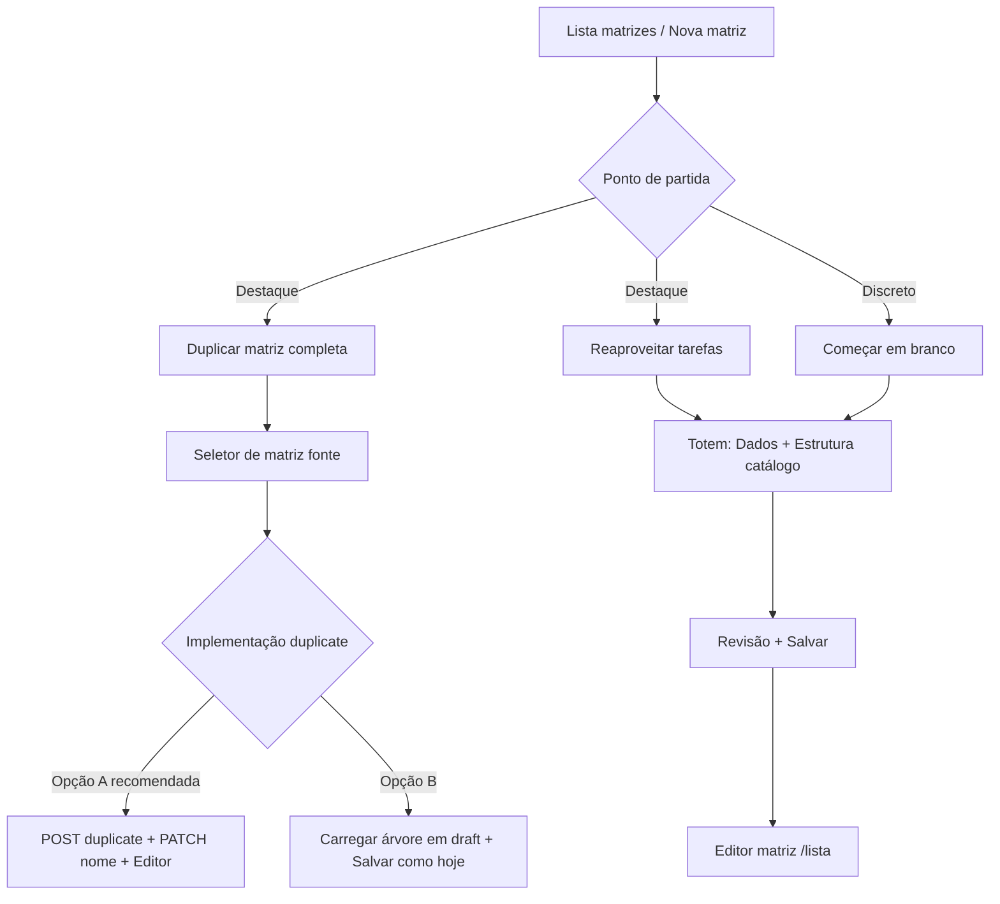

# SDD — Nova Matriz (duplicar + reaproveitar)

> **Etapa:** 1 — Discovery (SDD). Implementação bloqueada até aprovação explícita.
>
> **Repositório investigado:** `sgp-argos` — branch `develop` @ `5a986da0` (2026-07-05)
>
> **Protótipo de referência:** `docs/discovery/nova-matriz-criacao.html` — **não está no repositório** (ver seção 8).

---

## 0. Relação com a tela "assistida" já existente

### Veredito

**A rota `/app/matrizes-operacao/nova-assistida` e o componente `OperationMatrixAssistedPage.tsx` não existem em `develop`.**

| Verificação | Resultado |
|---|---|
| `grep` por `nova-assistida`, `OperationMatrixAssisted`, `operation-matrix-assisted` | **Zero ocorrências** em `src/`, rotas e navegação |
| `AppRoutes.tsx` | Rotas de matriz: `matrizes-operacao`, `matrizes-operacao/nova`, `matrizes-operacao/:itemId`, `matrizes-operacao/:itemId/preview` |
| `git log --all` em `**/OperationMatrixAssisted*` | **Histórico vazio** — arquivo nunca existiu neste repositório |
| Feature folder `operation-matrix-assisted` | **Inexistente** |

O relato anterior (MVP local sem persistência) **não corresponde ao código mergeado em `develop`**. Pode ter sido trabalho local, branch descartada ou plano não integrado.

### O que existe hoje no mesmo objetivo

O fluxo real de “nova matriz” está em:

- **Rota:** `/app/matrizes-operacao/nova`
- **Página:** `src/features/operation-matrix/OperationMatrixNewPage.tsx`
- **Shell:** `src/features/operation-matrix/criar-matriz/NovaMatrizCreateTotemShell.tsx` (abas Dados → Estrutura → Revisão)
- **Módulo:** `src/features/operation-matrix/criar-matriz/`

Esse fluxo **já cobre parcialmente** o protótipo aprovado:

| Objetivo do protótipo | Estado em `develop` |
|---|---|
| Reaproveitar tarefas de outras matrizes | **Parcial** — catálogo lateral (`NovaMatrizEstruturaCatalogPanel`), DnD, `cloneTaskSubtreeWithNewIds`, persistência via `cloneTaskSubtreeUnderItem` |
| Montar do zero | **Parcial** — tarefa em branco no rascunho + bloco “Adicionar nova estrutura (manual)” (`CriarMatrizEstruturaManual`) |
| Duplicar matriz completa | **Fora do wizard** — só na listagem (`OperationMatrixListPage` → `POST …/items/:id/duplicate`) |
| Tela de “ponto de partida” com hierarquia visual | **Ausente** — entra direto no totem, sem escolha de modo |
| Responsável principal + apoios por atividade | **Parcial / inconsistente** — ver §2.4 |

Componentes do wizard antigo (`CriarMatrizEtapaDadosBasico`, `CriarMatrizEtapaRevisao`, `CriarMatrizWizardChips`) **existem mas não são importados** por nenhuma página — substituídos pelo totem.

### Decisão proposta (seção 0)

| Opção | Avaliação |
|---|---|
| Evoluir tela “assistida” separada | **Inviável** — não há código para evoluir |
| Nova implementação paralela em rota nova | **Desaconselhado** — duplicaria `criar-matriz/` e o totem já é o “MVP evoluído” |
| **Evoluir `OperationMatrixNewPage` + `criar-matriz/`** | **Recomendado** — mesma rota `/nova`, adicionar passo de ponto de partida e alinhar UX ao protótipo |

**Não há conflito de rotas** com uma tela assistida fantasma. O risco é **duplicar UX** se alguém recriar `nova-assistida` em paralelo — o SDD assume **uma única entrada**: `/app/matrizes-operacao/nova`.

**Não tocar** na listagem/editor existentes exceto links de navegação se necessário. `OperationMatrixNewPage.tsx` **será evoluída** (não descartada).

---

## 1. Problema e objetivo

### Problema

Gestores criam matrizes novas com frequência a partir de padrões já validados na fábrica. O fluxo atual:

1. Não orienta o caminho mais comum (duplicar inteiro ou reaproveitar tarefas).
2. Repete o erro da Nova Esteira: modos competem em pé de igualdade quando existem (`NovaEsteiraModoEscolha.tsx` — grid 3 colunas iguais).
3. Duplicar matriz completa só está na listagem, desconectada do wizard de criação.
4. Reaproveitamento de tarefa não propaga `source_key` (dependência Sprint 1) — lineage quebrado para calibragem futura.
5. Responsável principal/apoio no rascunho de catálogo não está alinhado ao modelo de domínio nem à regra de negócio desejada (principal obrigatório).

### Objetivo

Uma experiência de **criação de matriz** com três caminhos explícitos:

1. **Duplicar matriz completa** (caminho sugerido #1).
2. **Montar reaproveitando tarefas** avulsas de outras matrizes (caminho sugerido #2).
3. **Começar em branco** (caso raro — visual secundário).

Cada atividade deve ter **exatamente um responsável principal** (obrigatório) e **apoios opcionais** (vários) — cenário de referência: especialista de couro como principal, estagiários como apoio.

Alinhar UI ao protótipo `nova-matriz-criacao.html` (quando disponível no repo).

---

## 2. Estado atual confirmado

### 2.1 Fluxo de criação (`criar-matriz/`)

```
OperationMatrixNewPage
  └── NovaMatrizCreateTotemShell (tabs: dados | estrutura | revisão)
        └── CriarMatrizEtapaEstrutura (totemMode=true)
              ├── NovaMatrizEstruturaCatalogPanel  ← catálogo de TASKs de todas as matrizes ativas
              ├── NovaMatrizEstruturaDraftPanel     ← rascunho (instâncias clonadas)
              └── CriarMatrizEstruturaManual        ← opções 100% manuais (secundário, rodapé)
```

**Persistência** (`handleSubmitFinal` em `OperationMatrixNewPage.tsx`):

1. `POST /operation-matrix/nodes` — ITEM raiz (nome, código, descrição).
2. Para cada `catalogOpcoesDraft` → `cloneTaskSubtreeUnderItem` (DFS de `POST /operation-matrix/nodes`).
3. Para cada `manualOpcoes` → `createManualOpcoesUnderItem`.
4. Navega para `/app/matrizes-operacao/{id}`.

**Catálogo:** `listMatrixItems` + `getMatrixTree` por item → `extractCatalogTasksFromItemTree` — uma entrada por TASK raiz.

**Reaproveitamento no draft:** `cloneTaskSubtreeWithNewIds` gera IDs client-side; bloqueia mesma `sourceTaskId` duas vezes no mesmo rascunho (`handleAddCatalogTask`).

**Equivalente a “modo escolha” para matriz:** **não existe**. `NovaEsteiraModoEscolha.tsx` é só para esteira (`src/features/esteiras/nova-esteira/`).

### 2.2 Duplicar matriz completa (fora do wizard)

| Camada | Detalhe |
|---|---|
| UI | `OperationMatrixListPage` — menu contextual “Duplicar matriz” + `window.confirm` |
| API | `POST /api/v1/operation-matrix/items/:id/duplicate` |
| Service | `serviceDuplicateMatrixItem` → `serviceDuplicateItemAsNewRoot` — copia árvore inteira, nome auto `Original (Cópia)` |
| `source_key` | Copiado **verbatim** (`source_key: r.source_key`) — não aplica regra `?? id` |
| `default_responsible_id` em ACTIVITY | **Zerado** na duplicação server-side (`null` para ACTIVITY) |
| Pós-ação | Toast + refresh da lista — **não** abre editor nem wizard |

### 2.3 Reaproveitamento / `source_key` (Sprint 1)

Estado conforme `docs/discovery/sdd-source-key-lineage.md` — **gap confirmado em `develop`:**

| Ponto | Arquivo | Gap |
|---|---|---|
| Clone draft catálogo | `cloneCatalogTaskSubtreeForDraft.ts` | Spread preserva `source_key` original (geralmente `null`); sem `resolveNodeSourceKey` |
| Persistência wizard | `cloneMatrixTaskSubtree.ts` | `sourceKey: node.source_key` sem fallback |
| Helper `resolveNodeSourceKey` | — | **Não existe** no código |

**Branch `feature/source-key-lineage-plumbing`:** não encontrada (local nem remote). Sprint 1 **não mergeado** em `develop`.

`matrixCatalogEntryOverlapsMatrix.ts` já antecipa dedup por `source_key` quando populado — benefício real só após Sprint 1.

### 2.4 Responsável principal / apoio

| Conceito | Onde | Estado |
|---|---|---|
| Domínio esteira | `PapelResponsavelStep`, `StepEquipeDetalhe.principal` / `.apoios` | Maduro em esteira/apontamento |
| Matriz — metadado | `matrixActivityCollaboratorsMeta.ts` | Principal = `default_responsible_id`; apoios = `metadata_json.sgp.matrixActivityCollaborators.v1.supportIds` |
| Manual draft | `criarMatrizManualDraft.ts` | `primaryCollaboratorId` + `collaboratorIds`; validação se >1 colaborador sem principal |
| UI manual | `CriarMatrizEstruturaManual.tsx` | Radio “Principal” + multi-colaborador |
| UI catálogo draft | `CriarMatrizCatalogOpcaoDraftEditor.tsx` | Só **“Equipe padrão”** (team); `applyEtapaToActivity` força `default_responsible_id: null` |
| Validação catálogo | `catalogOpcaoDraftValidation.ts` | Lê `default_responsible_id` + apoios — mas editor não grava principal |
| Persistência manual | `createManualMatrixStructure.ts` | **Não envia `defaultResponsibleId`** — só `metadataJson` com todos os IDs como apoios |
| Persistência catálogo | `cloneMatrixTaskSubtree.ts` | Não mapeia colaboradores individuais |

**Conclusão:** o modelo de domínio existe e é reaproveitável, mas o encanamento UI → POST está **incompleto** nos dois caminhos (catálogo e manual). A regra “principal obrigatório em toda atividade” **não está implementada** hoje (só “obrigatório se >1 colaborador” no manual).

### 2.5 APIs existentes (sem endpoint novo necessário para MVP)

| Método | Rota | Uso nesta feature |
|---|---|---|
| GET | `/operation-matrix/items` | Listar matrizes (ponto de partida — duplicar) |
| GET | `/operation-matrix/items/:id/tree` | Carregar árvore fonte / catálogo |
| POST | `/operation-matrix/items/:id/duplicate` | Duplicar matriz completa |
| POST | `/operation-matrix/nodes` | Criar ITEM + subárvore (fluxo atual) |
| PATCH | `/operation-matrix/nodes/:id` | Renomear matriz após duplicate (nome escolhido no wizard) |

---

## 3. Arquitetura proposta

### 3.1 Visão geral

Evoluir **`OperationMatrixNewPage`** inserindo um passo **`NovaMatrizPontoPartida`** antes do totem (ou como primeira “tab” bloqueante), sem nova rota.



### 3.2 Hierarquia visual (lição Nova Esteira)

Inspirar no protótipo, **não** copiar `NovaEsteiraModoEscolha`:

- Dois cards grandes (duplicar / reaproveitar) — borda gold, copy orientativa.
- “Começar em branco” — link ou card compacto abaixo, tom neutro.
- Após escolha, não mostrar os três modos com mesmo peso de novo.

### 3.3 Modo: Duplicar matriz completa

**Opção A (recomendada — menor risco):**

1. Usuário escolhe matriz fonte + informa nome desejado (aba Dados).
2. `duplicateMatrixItem(sourceId)` — API existente.
3. `patchMatrixNode(newId, { name })` — API existente.
4. Redirecionar para `/app/matrizes-operacao/{newId}` (editor) com toast de sucesso.

Vantagem: reutiliza lógica server-side testada; sem reimplementar clone de ITEM inteiro no client.

**Opção B (wizard unificado):**

1. `getMatrixTree(sourceId)` → converter TASKs em `catalogOpcoesDraft` (todas as tarefas) ou novo estado `fullMatrixDraft`.
2. Salvar via fluxo atual (`createMatrixNode` + `cloneTaskSubtreeUnderItem`).

Vantagem: uma única UX de “Salvar matriz” no totem. Desvantagem: mais código, dois caminhos de persistência divergentes.

**Decisão pendente de aprovação** (pergunta §8). SDD inclina para **Opção A** no PR-2.

### 3.4 Modo: Reaproveitar tarefas

Manter arquitetura atual do catálogo + rascunho. Melhorias:

- Copy do totem alinhada ao protótipo (“Montar combo a partir de bases existentes”).
- Após Sprint 1: `cloneTaskSubtreeWithNewIds` aplica `source_key = original.source_key ?? original.id`.
- Unificar editor de atividade do catálogo com padrão principal/apoio do manual (reutilizar trecho de UI de `CriarMatrizEstruturaManual` ou extrair `MatrizAtividadeEquipeEditor`).
- Persistir: `defaultResponsibleId` = principal; `metadataJson` = apoios apenas.

### 3.5 Modo: Começar em branco

- Iniciar com `catalogOpcoesDraft = []`, `manualOpcoes = []`.
- Painel catálogo recolhido ou com CTA “Buscar tarefas existentes” (não competir visualmente).
- Permitir “+ Nova tarefa” no rascunho (`onAddBlankCatalogOpcao`).

### 3.6 O que não fazer

- Não criar `OperationMatrixAssistedPage` nem rota `nova-assistida`.
- Não reativar wizard órfão (`CriarMatrizEtapaDadosBasico` / `CriarMatrizEtapaRevisao`) sem necessidade — preferir estender o totem.
- Não alterar `OperationMatrixListPage` duplicate além de eventual link “Criar a partir de…” (fora de escopo mínimo).

---

## 4. Dependência do Sprint 1

### Status em `develop` (2026-07-05)

| Item | Status |
|---|---|
| SDD `sdd-source-key-lineage.md` | Presente no repo |
| PR-1 `feature/source-key-lineage-plumbing` mergeado | **Não** |
| `resolveNodeSourceKey` implementado | **Não** |
| Testes de convergência de `source_key` em clones | **Não** |

### O que trava sem Sprint 1

| Funcionalidade | Sem Sprint 1 | Com Sprint 1 |
|---|---|---|
| UI ponto de partida + duplicate | **Pode implementar** | — |
| Reaproveitar tarefa com lineage correto | Salva com `source_key = null` | `source_key` estável entre matrizes |
| Teste “dois clones → mesma source_key” | **Falha** | Passa |
| Dedup por `matrixCatalogEntryOverlapsMatrix` | Só por nome | Por `source_key` confiável |

**Regra de execução:** Etapa 2 desta feature **não inicia** reaproveitamento com critério de aceite de lineage até Sprint 1 mergeado. Duplicate completo e UI podem ser PRs preparatórios se explicitamente acordado — mas o checklist de testes do briefing exige `source_key` populado.

### Interação com duplicate server-side

`serviceDuplicateItemAsNewRoot` copia `source_key` existente mas **não aplica** `?? id`. Matrizes legadas com `null` continuam `null` após duplicate. Alinhar com dono do produto se duplicate completo deve chamar mesma regra de lineage (possível extensão do Sprint 1 no backend — **reportar antes de implementar**).

---

## 5. Impacto no contrato de API

### Sem endpoint novo (MVP proposto)

Toda a feature pode usar APIs listadas em §2.5.

### Extensões opcionais (parar e reportar antes de implementar)

| Mudança | Motivo | Impacto |
|---|---|---|
| `POST …/duplicate` aceitar `{ name?: string }` no body | Evitar round-trip duplicate + PATCH | Aditivo, backward-compatible |
| Duplicate server aplicar `resolveNodeSourceKey` por nó | Lineage em matrizes duplicadas | Comportamento novo em dados; sem migration |
| Batch “clone N tasks” em um POST | Performance em matrizes grandes | **Não recomendado** no MVP — N já é sequencial hoje |

### Campos já suportados relevantes

`CreateMatrixNodeInput`: `defaultResponsibleId`, `sourceKey`, `metadataJson`, `teamIds` — schemas em `operation-matrix.schemas.ts`.

---

## 6. Compatibilidade multi-tenant

- Deploy atual: instância dedicada (Bravo); **sem `tenant_id`** em `matrix_nodes`.
- Catálogo de reaproveitamento lista **todas** as matrizes ativas do ambiente — comportamento atual, não introduzido por esta feature.
- `source_key` é opaco por ambiente; isolamento PRD/HML via banco separado (regra vigente).
- Matrizes com `source_key = null` permanecem válidas; lineage só em novos fluxos pós-Sprint 1.

---

## 7. Estratégia de teste

### 7.1 Unitários (Vitest)

| Cenário | Arquivo alvo |
|---|---|
| Ponto de partida — modo default / transição de estado | Novo teste em componente ou hook |
| `cloneTaskSubtreeWithNewIds` — lineage (pós-Sprint 1) | `cloneCatalogTaskSubtreeForDraft` (+ teste existente estender) |
| Principal obrigatório — validação rejeita atividade sem principal | `catalogOpcaoDraftValidation.ts` (+ ajuste de regra) |
| Principal + apoios persistidos no POST | `cloneMatrixTaskSubtree.test.ts`, `createManualMatrixStructure` |
| `activityToEtapa` / `applyEtapaToActivity` simetria | `CriarMatrizCatalogOpcaoDraftEditor` (extrair funções testáveis) |

### 7.2 Integração

| Cenário | Tipo |
|---|---|
| Reaproveitar TASK → salvar matriz → nós com `source_key` esperado | API mock ou integração operation-matrix |
| Duplicate completo preserva estrutura (contagens TASK/SECTOR/ACTIVITY) | Já coberto parcialmente no backend; smoke no frontend |
| Dois clones da mesma tarefa → mesmo `source_key` | **Bloqueante Sprint 1** |

### 7.3 E2E / manual

- Fluxo gestor: Lista → Nova matriz → Duplicar → renomear → editor.
- Fluxo gestor: Reaproveitar 2 tarefas de matrizes diferentes → definir principal/apoio → salvar.
- “Começar em branco” visivelmente secundário (screenshot vs protótipo).
- Regressão: listagem duplicate contextual continua funcionando.

---

## 8. Riscos e perguntas em aberto

1. **Protótipo HTML ausente** — `nova-matriz-criacao.html` não está no repo. Anexar antes da Etapa 2 para validação visual pixel-a-pixel.
2. **Duplicate: Opção A vs B** (§3.3) — wizard unificado vs redirect para editor após API duplicate?
3. **Principal obrigatório sempre** vs só quando há apoios — briefing diz obrigatório; código atual só exige com >1 colaborador. Confirmar regra para atividade sem nenhum colaborador (só equipe padrão?).
4. **Duplicate server zera `default_responsible_id`** em ACTIVITY — é intencional? Wizard pode precisar reatribuir principais após duplicate.
5. **Sprint 1 no backend de duplicate** — aplicar `source_key ?? id` em `serviceDuplicateItemAsNewRoot`?
6. **Performance** — matriz com muitas TASKs no catálogo: `listMatrixItems` + N × `getMatrixTree` já ocorre hoje; monitorar se ponto de partida piora UX.
7. **Tela assistida fantasma** — alguém tem branch local? Se merge futuro, resolver conflito com esta decisão antes.

---

## 9. Plano de PRs

> PRs pequenos; implementação só após aprovação deste SDD **e** merge Sprint 1 para critérios de lineage.

### PR-1 — Ponto de partida + hierarquia visual

| Escopo | Arquivos principais |
|---|---|
| Componente `NovaMatrizPontoPartida` | Novo em `criar-matriz/` |
| Estado `creationMode` em `OperationMatrixNewPage` | `OperationMatrixNewPage.tsx` |
| Ajuste totem para respeitar modo (layout catálogo / blank) | `NovaMatrizCreateTotemShell.tsx`, `CriarMatrizEtapaEstrutura.tsx` |
| Testes de transição de modo | `*.test.ts(x)` |

**Sem API nova.** Pode iniciar antes do Sprint 1 (sem testes de lineage).

### PR-2 — Duplicar matriz completa no wizard

| Escopo | Detalhe |
|---|---|
| Seletor de matriz + nome | UI no fluxo duplicate |
| Integração | `duplicateMatrixItem` + `patchMatrixNode` (Opção A) |
| Navegação pós-sucesso | Editor da nova matriz |

**Parar e reportar** se optar por body `{ name }` no POST duplicate.

### PR-3 — Principal/apoio no rascunho + persistência

| Escopo | Arquivos |
|---|---|
| UI principal/apoio no editor de catálogo | `CriarMatrizCatalogOpcaoDraftEditor.tsx` |
| Fix persistência manual + catálogo | `createManualMatrixStructure.ts`, `cloneMatrixTaskSubtree.ts` |
| Validação principal obrigatório | `catalogOpcaoDraftValidation.ts`, `criarMatrizManualDraft.ts` |
| Testes | conforme §7 |

### PR-4 — Lineage reaproveitamento (pode ser só merge Sprint 1 + smoke)

| Escopo | Detalhe |
|---|---|
| Depende | Sprint 1 mergeado |
| Verificar | Wizard nova matriz usa clone atualizado |
| Testes E2E lineage | briefing Sprint 3 |

**Ordem sugerida:** Sprint 1 merge → PR-1 → PR-2 ∥ PR-3 → PR-4 validação.

---

## 10. Conferência item a item

| # | Item | Status | Nota |
|---|---|---|---|
| 1 | Tela "assistida" existente tem relação direta com este objetivo | **Não existe** | Relato anterior não reflete `develop`; objetivo já está parcialmente em `OperationMatrixNewPage` + totem |
| 2 | Fluxo `criar-matriz/` é a base a evoluir, ou nova tela separada | **Evoluir `criar-matriz/`** | Mesma rota `/nova`; não criar `nova-assistida` |
| 3 | Reaproveitamento de tarefa depende do Sprint 1 estar mergeado | **Confirmado** | `source_key` não propagado; branch Sprint 1 ausente em `develop` |
| 4 | Responsável principal/apoio já existe no domínio, reaproveitável | **Confirmado com gaps** | Modelo em `matrixActivityCollaboratorsMeta` + manual draft; UI/persistência incompletas no catálogo |

---

## Checklist final de verificação

### Verificado em runtime

_Nada nesta etapa — SDD é somente investigação de código; app não foi executado._

### Verificado por humano (investigação estática no repo)

- [x] Ausência de rota/componente `nova-assistida` / `OperationMatrixAssistedPage`
- [x] Rotas de matriz em `AppRoutes.tsx`
- [x] Fluxo `OperationMatrixNewPage` → totem → `CriarMatrizEtapaEstrutura`
- [x] Catálogo e clone de TASK (`extractMatrixTasksForCatalog`, `cloneCatalogTaskSubtreeForDraft`)
- [x] Duplicate na listagem (`duplicateMatrixItem`, `serviceDuplicateMatrixItem`)
- [x] Gap `source_key` e ausência de `resolveNodeSourceKey`
- [x] Sprint 1 não mergeado (`develop` @ `5a986da0`, sem branch `source-key-lineage`)
- [x] Modelo principal/apoio e gaps de persistência
- [x] `NovaEsteiraModoEscolha` — referência de anti-padrão visual
- [x] Protótipo `nova-matriz-criacao.html` ausente do repo
- [x] APIs existentes suficientes para MVP sem endpoint novo

### Não verificado

- [ ] Comportamento visual do protótipo HTML (arquivo não disponível)
- [ ] UX em browser do totem atual (DnD, performance catálogo grande)
- [ ] Intenção original do MVP “assistida” (sem código ou branch)
- [ ] Regra exata “principal obrigatório” com equipe padrão sem colaborador
- [ ] Se duplicate server-side deve preservar ou zerar responsáveis (comportamento atual zera em ACTIVITY)
- [ ] Aprovação Opção A vs B para duplicate no wizard

---

## Fora de escopo

- Tela Agenda da Semana (`weekly-agenda`)
- Motor de calibragem
- Painel matching Nano→SGP
- Totem de criação de esteira (Sprint 4)
- UI decisão manter/quebrar vínculo ao renomear atividade reaproveitada (Sprint 1 PR-2 futuro)
