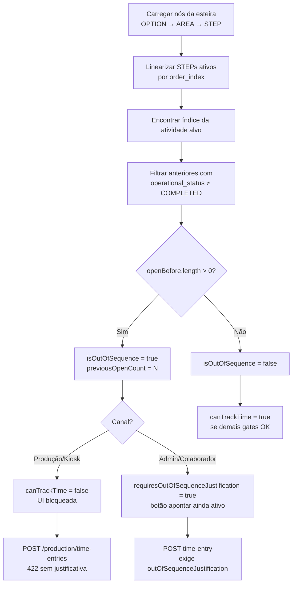

# Inventário — Bloqueio por atividade anterior pendente

> **Escopo:** investigação técnica e funcional — junho/2026.  
> **Sem alterações de comportamento** — apenas mapeamento do código existente.

---

## Resumo executivo

| Item | Conclusão |
|------|-----------|
| **A regra nasce em** | **Backend** — função central `analyzeConveyorActivitySequence()` |
| **Campos envolvidos** | `isOutOfSequence`, `previousOpenCount`, `previousOpenActivities`, `canTrackTime`, `isActivityCompleted`, `requiresOutOfSequenceJustification` |
| **Mensagens encontradas** | Ver seção [Mensagens exibidas](#mensagens-exibidas) |
| **Telas afetadas** | Kiosk (`/app/kiosk`), Modo Produção (`/app/producao`), Minha fila, Quick apontamento, Planejamento, Detalhe da esteira, Jornada |
| **Endpoints afetados** | Ver seção [Endpoints afetados](#endpoints-afetados) |
| **Principal hipótese de problema** | Atividade anterior com **tempo realizado = planejado (100%)** mas **`operational_status ≠ COMPLETED`** continua bloqueando a próxima — comportamento **esperado pelo código atual**, não bug de sequência |
| **Pontos que precisam decisão de negócio** | Ver seção [Recomendações](#recomendações) |

---

## Respostas objetivas (checklist da investigação)

### 5.1 A regra nasce no backend ou no frontend?

**Backend**, com consumo no frontend.

1. O backend calcula `isOutOfSequence` e `previousOpenCount` via `analyzeConveyorActivitySequence()`.
2. O endpoint de produção deriva `canTrackTime` em `resolveProductionCanTrackTime()`.
3. O frontend **não recalcula** a sequência — apenas exibe mensagens com base nos campos da API.

**Exceção parcial:** mocks de nova-esteira (`src/mocks/nova-esteira-composicao.ts`) têm lógica de pré-requisito para **composição de esteira em draft**, não ligada ao bloqueio operacional de apontamento.

### 5.2 Qual campo controla o bloqueio?

| Campo | Onde | Papel |
|-------|------|-------|
| `isOutOfSequence` | DTOs de fila, candidatos, backlog | `true` = existem anteriores com status ≠ `COMPLETED` |
| `previousOpenCount` | Idem | Quantidade de anteriores abertas |
| `previousOpenActivities` | Admin/colaborador (até 3 amostras) | Detalhe das pendências |
| `canTrackTime` | **Somente** `ProductionWorkQueueItem` | `false` bloqueia UI e impede apontamento no kiosk/produção |
| `isActivityCompleted` | Vários DTOs | `activity_operational_status === 'COMPLETED'` |
| `requiresOutOfSequenceJustification` | Admin (`/me/work-queue`, candidatos) | Exige justificativa no POST — **não bloqueia** o botão na fila admin |
| `canCompleteStep` | Produção | **Sempre `false`** nesta sprint — conclusão explícita indisponível no modo fábrica |

Não existem campos `blockedReason`, `blockedBy`, `blockedByPrevious` ou `pendingPreviousCount` — o padrão adotado é `isOutOfSequence` + `previousOpenCount`.

### 5.3 Qual é a condição exata?

Uma atividade alvo fica **`isOutOfSequence = true`** quando, na **sequência linear global da esteira**, existe **ao menos uma** atividade (STEP) **anterior** cujo `operational_status` **não é** `COMPLETED` (inclui `PENDING`, `IN_PROGRESS`, `BLOCKED`, `REOPENED`; `null` trata-se como `PENDING`).

No **Modo Produção/Kiosk**, adicionalmente:

```text
canTrackTime = false  SE  isOutOfSequence = true
                   OU  isActivityCompleted = true
                   OU  planItemStatus = 'CANCELLED'
                   OU  conveyorOperationalStatus ∉ { A_INICIAR, EM_ANDAMENTO }
```

### 5.4 O que é considerado “atividade anterior”?

| Critério | Considerado? |
|----------|--------------|
| Sequência global da esteira (todas as tarefas/setores) | **Sim** — linearização OPTION → AREA → STEP |
| Ordenação por `order_index` em cada nível | **Sim** |
| Apenas mesma tarefa (OPTION) | **Não** — atravessa tarefas |
| Apenas mesmo setor (AREA) | **Não** — atravessa setores |
| Apenas atividades do mesmo colaborador | **Não** |
| Apenas itens da semana planejada | **Não** — usa nós estruturais da esteira |
| Dependência explícita / grafo de pré-requisitos | **Não** — só ordem estrutural |
| Nós STEP inativos (`is_active = false`) | **Ignorados** na linearização |
| Nós OPTION/AREA inativos | Subárvore ignorada |

Formato do caminho de ordem: `{tarefa}.{setor}.{atividade}` (ex.: `1.1.2`).

### 5.5 O que é considerado “concluída”?

**Somente** `conveyor_nodes.operational_status = 'COMPLETED'` para o STEP.

**Não** concluem a atividade:

- `realizedMinutes >= plannedMinutes`
- `sessionCompletionPct = 100`
- `markAsDone = true` no apontamento
- `executedQuantity >= plannedQuantity`
- `operational_completed_at` preenchido sem status `COMPLETED`

Documentação de domínio: `docs/conclusao-explicita-step.md` e `calculateConveyorStepCompletionState()`.

### 5.6 Apontamento de tempo basta para concluir?

**Não.** O fluxo de apontamento (`serviceCreateConveyorTimeEntry`) **não altera** `operational_status` para `COMPLETED`.

- `markAsDone` é **persistido** em `conveyor_time_entries.mark_as_done` mas **não dispara** conclusão operacional.
- Comentário explícito em `production-time-entries.service.ts`: *"Nunca conclui o STEP automaticamente."*
- Conclusão exige `PATCH …/steps/:stepNodeId/completion` com `action: 'COMPLETE'` (disponível no detalhe da esteira / planejamento admin, **não** no kiosk).

**Cenário do print (hipótese):** Atividade 1 com Realizado 15 min / Planejado 15 min → anel **100% previsto** (`realizedMinutes / plannedMinutes`). Status operacional permanece `PENDING` ou `IN_PROGRESS`. Atividade 2 corretamente reporta `isOutOfSequence = true` e bloqueia apontamento.

### 5.7 A regra considera quantidade planejada/executada?

**Não** na sequência nem na conclusão. `executedQuantity` não participa de `analyzeConveyorActivitySequence` nem de `calculateConveyorStepCompletionState`.

Quantidade existe para carga/tempo total (`planned_quantity × planned_minutes`) mas **não** altera o gate de sequência.

### 5.8 A regra se comporta igual para admin e modo fábrica?

**Não.** Mesma detecção de sequência; **política de bloqueio diferente**:

| Contexto | Fora de sequência | Apontamento |
|----------|-------------------|-------------|
| **Kiosk / `/app/producao`** | `canTrackTime = false` — **bloqueio total** | POST `/production/time-entries` rejeita sem justificativa |
| **Minha fila / colaborador admin** | Badge + aviso; botão **habilitado** se não concluída | POST time-entry **permite** com `outOfSequenceJustification` |
| **QuickTimeEntryDrawer** | Aviso + campo obrigatório de justificativa | Submete com justificativa |
| **Planejamento** | Label "Fora de sequência"; ações de apontar/concluir seguem status | Conclusão OOS exige justificativa via `sequence-check` |
| **Detalhe da esteira** | Prefetch `sequence-check` antes de concluir | Conclusão OOS exige justificativa |

---

## Fluxo atual da regra



**Passo a passo:**

1. Repository carrega nós via `listConveyorNodesForSequenceAnalysis(conveyorId)`.
2. `analyzeConveyorActivitySequence(nodes, activityNodeId)` lineariza e conta anteriores abertas.
3. Serviços de fila (`my-work-queue`, `production-work-queue`, `my-activities`, `operational-planning`) propagam flags para DTOs.
4. Produção aplica `resolveProductionCanTrackTime()` → `canTrackTime`.
5. Frontend exibe mensagens conforme `canTrackTime` / `isOutOfSequence`.
6. Na submissão, produção revalida sequência e **rejeita** OOS; admin **aceita** com justificativa.

---

## Tabela de ocorrências

| Camada | Arquivo | Função/Componente | Campo/Mensagem | O que faz | Observação |
|--------|---------|-------------------|----------------|-----------|------------|
| Backend | `conveyorActivitySequence.logic.ts` | `analyzeConveyorActivitySequence` | `isOutOfSequence`, `previousOpenCount` | **Origem da regra** | Núcleo — linearização global |
| Backend | `conveyorActivitySequence.service.ts` | `serviceAnalyzeConveyorActivitySequence` | — | Wrapper DB → logic | Usado em time-entry e sequence-check |
| Backend | `production-work-queue.rules.ts` | `resolveProductionCanTrackTime` | `canTrackTime` | Bloqueio produção | `isOutOfSequence → false` |
| Backend | `production-work-queue.service.ts` | `mapToProductionItem` | DTO produção | Mapeia fila admin → produção | Adiciona `canTrackTime`, `realizedMinutes` |
| Backend | `my-work-queue.service.ts` | `serviceGetWorkQueueForCollaborator` | `isOutOfSequence`, `previousOpen*` | Fila colaborador/planejamento | Base compartilhada produção |
| Backend | `my-activities.service.ts` | `mapCandidateRow` | Candidatos apontamento | Sequência em busca rápida | Drawer / apontamento |
| Backend | `operational-planning.service.ts` | `serviceListOperationalPlanningBacklog` | Backlog plano | Indicador OOS no backlog | Sem bloqueio de API |
| Backend | `production-time-entries.service.ts` | `serviceCreateProductionTimeEntry` | Erro 422 OOS | **Bloqueio hard** produção | Sem caminho de justificativa |
| Backend | `conveyorAssignments.service.ts` | `serviceCreateConveyorTimeEntryForAppUser` | `outOfSequenceJustification` | Admin: permite OOS c/ justificativa | Valida sequência no POST |
| Backend | `conveyor-step-operational.service.ts` | `serviceCompleteStep` | OOS na conclusão | Conclusão explícita | Exige justificativa se OOS |
| Backend | `conveyor-step-completion-state.ts` | `calculateConveyorStepCompletionState` | `operationalStatus === COMPLETED` | Define “concluída” | Tempo ≠ conclusão |
| Backend | `conveyorAssignments.controller.ts` | `getConveyorStepSequenceCheck` | GET sequence-check | Pré-checagem para UI | Usado em esteira e planejamento |
| Backend | `conveyorOperationalStatus.ts` | `canConveyorAcceptTimeEntry` | Status esteira | Gate adicional | Só `A_INICIAR`, `EM_ANDAMENTO` |
| Frontend | `KioskActivityCard.tsx` | Card kiosk | 3 mensagens usuário | UI bloqueio produção | Anel 100% = tempo, não status |
| Frontend | `ProductionWorkQueuePage.tsx` | Card produção | Aviso OOS + botão disabled | UI `/app/producao` | Usa `productionTrackTimeDisabledTitle` |
| Frontend | `production.helpers.ts` | `productionTrackTimeDisabledTitle` | Mensagens tooltip | Helper mensagens | |
| Frontend | `MyWorkQueuePage.tsx` | Fila colaborador | Badge + contagem anteriores | **Não** desabilita por OOS | Só desabilita se concluída |
| Frontend | `QuickTimeEntryDrawer.tsx` | Drawer apontamento | Aviso + textarea justificativa | Admin apontamento | Permite OOS |
| Frontend | `EsteiraDetalhePage.tsx` | Concluir etapa | Dialog OOS | Prefetch sequence-check | Conclusão gestor |
| Frontend | `OperationalPlanningPage.tsx` | Cards plano | "Fora de sequência" | Planejamento semanal | sequence-check no complete |
| Frontend | `PlanningDailyPlanCard.tsx` | Card dia | Label OOS | Visual | |
| Frontend | `JornadaPage.tsx` / `JornadaColaboradorGestorPage.tsx` | Histórico | Badge OOS em entries | Informativo pós-fato | |
| Testes | `conveyorActivitySequence.logic.test.ts` | — | Casos linearização | Unitário núcleo | |
| Testes | `production-work-queue.rules.test.ts` | — | `canTrackTime` | Unitário produção | |
| Testes | `production-time-entries.integration.test.ts` | — | POST bloqueado OOS | Integração | |
| Testes | `my-work-queue.service.test.ts` | — | Propagação flags | Integração | |
| Docs | `conclusao-explicita-step.md` | — | Conclusão explícita | Decisão produto | Tempo ≠ COMPLETED |

---

## Backend

### Núcleo da sequência

**Arquivo:** `server/src/modules/conveyors/conveyorActivitySequence.logic.ts`

```typescript
// Condensado — lógica real
const openBefore = linear.slice(0, idx).filter(
  (e) => (e.step.operational_status ?? 'PENDING') !== 'COMPLETED',
)
return {
  isOutOfSequence: openBefore.length > 0,
  previousOpenCount: openBefore.length,
  previousOpenActivities: summaries,
}
```

### Serviços que consomem a análise

| Serviço | Uso |
|---------|-----|
| `my-work-queue.service.ts` | GET `/me/work-queue`, base do GET produção |
| `production-work-queue.service.ts` | GET `/production/me/work-queue` + `canTrackTime` |
| `my-activities.service.ts` | Candidatos de apontamento (Minhas atividades / drawer) |
| `operational-planning.service.ts` | Backlog operacional do planejamento |
| `production-time-entries.service.ts` | Validação no POST produção |
| `conveyorAssignments.service.ts` | Validação no POST admin + registro `is_out_of_sequence` |
| `conveyor-step-operational.service.ts` | Validação na conclusão explícita |

### DTOs principais

| DTO | Campos de sequência |
|-----|---------------------|
| `MyWorkQueueItemApi` | `isOutOfSequence`, `previousOpenCount`, `previousOpenActivities`, `requiresOutOfSequenceJustification`, `isActivityCompleted` |
| `ProductionWorkQueueItemApi` | Subconjunto + `canTrackTime`, `canCompleteStep: false` |
| `TimeEntryCandidateItemApi` | `isOutOfSequence`, `previousOpenCount`, `previousOpenActivities` |
| `BacklogItemApi` | `isOutOfSequence`, `previousOpenCount` |

### Endpoints afetados

| Método | Endpoint | Retorna bloqueio? | Bloqueia POST? |
|--------|----------|-------------------|----------------|
| GET | `/api/v1/production/me/work-queue` | `canTrackTime`, `isOutOfSequence` | — |
| POST | `/api/v1/production/time-entries` | — | **Sim** — OOS = 422 |
| GET | `/api/v1/me/work-queue` | `isOutOfSequence`, `requiresOutOfSequenceJustification` | — |
| GET | `/api/v1/me/activities/time-entry-candidates` | Idem candidatos | — |
| POST | `/api/v1/conveyors/:id/steps/:stepId/time-entries` | — | OOS exige justificativa |
| GET | `/api/v1/conveyors/:id/steps/:stepId/sequence-check` | Pré-checagem completa | — |
| PATCH | `/api/v1/conveyors/:id/steps/:stepId/completion` | — | OOS exige justificativa |
| GET | `/api/v1/operational-planning/backlog` | `isOutOfSequence` | — |

---

## Frontend

### Rotas

| Rota | Componente | Comportamento OOS |
|------|------------|-------------------|
| `/app/kiosk` | `KioskPage` → `KioskActivityCard` | Bloqueio total via `canTrackTime` |
| `/app/producao` | `ProductionWorkQueuePage` | Bloqueio total via `canTrackTime` |
| `/app/colaborador/minha-fila` | `MyWorkQueuePage` | Aviso; apontamento permitido c/ justificativa |
| Drawer global | `QuickTimeEntryDrawer` | Justificativa OOS obrigatória |
| `/app/planejamento` | `OperationalPlanningPage` | Label + sequence-check na conclusão |
| `/app/esteiras/:id` | `EsteiraDetalhePage` | Concluir etapa + dialog OOS |

### Mensagens — mapeamento UI

| Condição UI | Mensagem |
|-------------|----------|
| `!canTrackTime && isOutOfSequence` (kiosk header) | "Conclua a atividade anterior antes de apontar nesta" |
| `!canTrackTime && isOutOfSequence` (kiosk corpo) | "Existe N anterior(es) pendente(s). Conclua-a(s) primeiro." |
| `!canTrackTime && !isOutOfSequence && !isActivityCompleted` | "Apontamento bloqueado para esta atividade" / "Apontamento não disponível para esta atividade no momento." |
| `canTrackTime` disabled tooltip (produção) | "Conclua ou aponte a atividade anterior antes de iniciar esta." |
| Admin fila | "N atividade(s) anterior(es) ainda em aberto." |
| QuickTimeEntryDrawer | "Existem atividades anteriores ainda pendentes nesta esteira…" |
| POST produção (API) | "Conclua ou aponte a atividade anterior antes de iniciar esta." |

---

## Mensagens exibidas

Lista consolidada (strings exatas ou templates):

1. `Conclua a atividade anterior antes de apontar nesta` — `KioskActivityCard.tsx`
2. `Existe{m} N anterior(es) pendente(s). Conclua-{as/a} primeiro.` — `KioskActivityCard.tsx`
3. `Apontamento bloqueado para esta atividade` — `KioskActivityCard.tsx`
4. `Apontamento não disponível para esta atividade no momento.` — `KioskActivityCard.tsx`
5. `Atividade concluída` / `Esta atividade já foi concluída operacionalmente.` — kiosk
6. `Conclua ou aponte a atividade anterior antes de iniciar esta.` — `production.helpers.ts`, `ProductionWorkQueuePage.tsx`
7. `Apontamento indisponível para esta atividade.` — `production.helpers.ts`
8. `N atividade(s) anterior(es) ainda em aberto.` — `MyWorkQueuePage.tsx`
9. `Fora de sequência` — badges em fila, planejamento, helpers
10. `Existem atividades anteriores ainda pendentes nesta esteira` — `QuickTimeEntryDrawer.tsx`, `EsteiraDetalhePage.tsx`
11. `Informe uma justificativa para executar esta atividade fora da sequência recomendada.` — backend admin (422)
12. `Conclua ou aponte a atividade anterior antes de iniciar esta.` — backend produção (422)

---

## Critérios atuais de bloqueio

### Sequência (comum a todos os canais)

```text
isOutOfSequence = ∃ step anterior na linearização global
                  tal que operational_status ≠ 'COMPLETED'
```

### Modo Produção/Kiosk (bloqueio adicional)

```text
canTrackTime = !isActivityCompleted
            AND !isOutOfSequence
            AND planItemStatus ≠ 'CANCELLED'
            AND conveyorOperationalStatus ∈ { A_INICIAR, EM_ANDAMENTO }
            AND isPlannedForCollaborator (sempre true na fila produção)
```

### Modo Admin (sem bloqueio de UI por sequência)

- Botão apontar: desabilitado **apenas** se `isActivityCompleted`.
- Backend no POST: se `isOutOfSequence`, exige `outOfSequenceJustification` não vazia.

---

## Critérios atuais de conclusão

| Critério | Conclui STEP? |
|----------|---------------|
| `PATCH …/completion` action `COMPLETE` | **Sim** |
| `operational_status = COMPLETED` | **Sim** (estado resultante) |
| Apontamento de minutos | **Não** |
| `realizedMinutes >= plannedMinutes` | **Não** |
| `markAsDone = true` no time entry | **Não** (só persiste flag) |
| `sessionCompletionPct = 100` | **Não** (metadado) |
| `executedQuantity >= plannedQuantity` | **Não** |

Referência: `docs/conclusao-explicita-step.md`, `conveyor-step-completion-state.ts`.

---

## Possíveis inconsistências encontradas

### 1. Tempo 100% vs status operacional (principal)

- UI kiosk mostra anel **"100% previsto"** = `realizedMinutes / plannedMinutes`.
- Sequência usa **`operational_status`**, não minutos.
- **Resultado:** atividade "cheia" de tempo continua bloqueando a seguinte — **comportamento coerente com código, confuso para operador**.

### 2. `markAsDone` sem efeito na conclusão

- Checkbox "Marcar como concluída" no kiosk persiste `mark_as_done` mas **não** muda `operational_status`.
- Operador pode acreditar que concluiu; sequência não muda.

### 3. Produção sem conclusão de etapa

- `canCompleteStep: false` fixo no DTO produção.
- Colaborador no tablet **não pode** concluir explicitamente — depende de gestor na esteira/planejamento.

### 4. Política divergente admin vs fábrica

- Mesma detecção OOS; admin pode apontar com justificativa, fábrica não.
- Pode gerar expectativa inconsistente entre perfis.

### 5. Terminologia "previsto" no anel do kiosk

- Label "100% previsto" refere-se a **cobertura de tempo apontado**, não progresso da atividade nem conclusão operacional.

### 6. Quantidade operacional ignorada

- Introdução de `planned_quantity` / `executed_quantity` **não** integrada ao gate de sequência ou conclusão.

### 7. Status intermediários contam como pendência

- `IN_PROGRESS` e `REOPENED` bloqueiam igual a `PENDING` — não há distinção "já iniciada".

---

## Recomendações

**Próximos passos sugeridos (decisão de negócio — não implementados):**

1. **Decidir se apontamento com `markAsDone=true` deve concluir o STEP** no modo fábrica — hoje a UI promete isso, o backend não executa.
2. **Decidir se tempo realizado ≥ planejado deve auto-concluir** ou se a conclusão explícita permanece obrigatória (estado atual documentado).
3. **Habilitar "Concluir etapa" no kiosk/produção** (`canCompleteStep`) ou fluxo alternativo para colaborador encerrar a atividade anterior sem ir ao painel gestor.
4. **Revisar copy do anel "100% previsto"** — renomear para "tempo apontado" ou similar para não confundir com conclusão.
5. **Avaliar política OOS na fábrica** — manter bloqueio total vs permitir justificativa como no admin.
6. **Integrar quantidade executada** à conclusão, se for requisito futuro.
7. **Telemetria:** logar `previousOpenActivityIds` quando kiosk bloqueia — facilita suporte.

---

## Resultado esperado (síntese final)

### Causa técnica

A regra centraliza-se em `analyzeConveyorActivitySequence()`: lineariza todos os STEPs ativos da esteira e marca `isOutOfSequence` quando algum anterior tem `operational_status ≠ COMPLETED`. O Modo Produção traduz isso em `canTrackTime = false` e rejeita POST sem justificativa. **Tempo apontado e `markAsDone` não alteram `operational_status`.**

### Regra atual

> "Atividade anterior pendente" = qualquer STEP anterior na ordem estrutural global da esteira cujo status operacional não seja `COMPLETED`. Apenas conclusão explícita (`operational_status = COMPLETED`) libera a sequência.

### Arquivos envolvidos (principais)

- `server/src/modules/conveyors/conveyorActivitySequence.logic.ts`
- `server/src/modules/production/production-work-queue.rules.ts`
- `server/src/modules/production/production-work-queue.service.ts`
- `server/src/modules/my-work-queue/my-work-queue.service.ts`
- `server/src/modules/production/production-time-entries.service.ts`
- `server/src/modules/conveyors/conveyorAssignments.service.ts`
- `server/src/modules/conveyors/conveyor-step-operational.service.ts`
- `server/src/modules/conveyors/operational-events/conveyor-step-completion-state.ts`
- `src/features/kiosk/KioskActivityCard.tsx`
- `src/features/production/ProductionWorkQueuePage.tsx`
- `src/domain/production/production.helpers.ts`

### Telas afetadas

Kiosk, Modo Produção, Minha fila, Quick apontamento, Planejamento operacional, Detalhe da esteira, Jornada (indicador histórico).

### Endpoints afetados

`GET /production/me/work-queue`, `POST /production/time-entries`, `GET /me/work-queue`, `GET …/time-entry-candidates`, `POST …/time-entries`, `GET …/sequence-check`, `PATCH …/completion`, `GET /operational-planning/backlog`.

### Riscos

- Operadores no tablet bloqueados após apontar 100% do tempo sem concluir explicitamente.
- `markAsDone` cria expectativa falsa de conclusão.
- Gestores precisam concluir etapas remotamente — gargalo operacional.
- Divergência admin/fábrica pode confundir treinamento.

### Recomendação de correção

**Não corrigir código ainda.** Priorizar decisão de produto entre:

- **(A)** Manter conclusão explícita e ajustar UX (copy, botão concluir no kiosk, feedback pós-apontamento "falta concluir etapa");
- **(B)** Fazer `markAsDone` ou tempo ≥ planejado disparar `COMPLETED` automaticamente no modo fábrica;
- **(C)** Relaxar sequência na fábrica (justificativa como admin).

Após decisão, implementar de forma centralizada em `conveyor-step-operational.service.ts` / `production-time-entries.service.ts` para evitar divergência backend/frontend.

---

*Gerado por varredura técnica do repositório SGP+ Web — junho/2026.*
